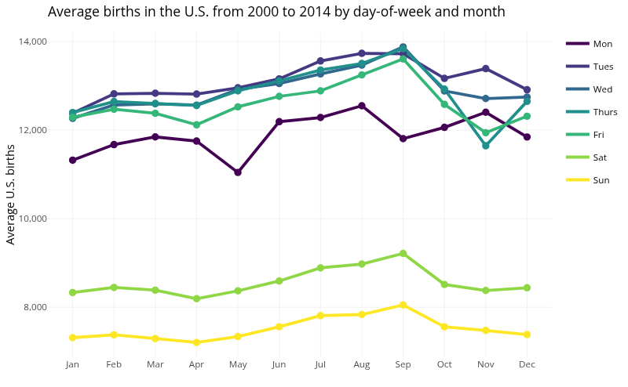
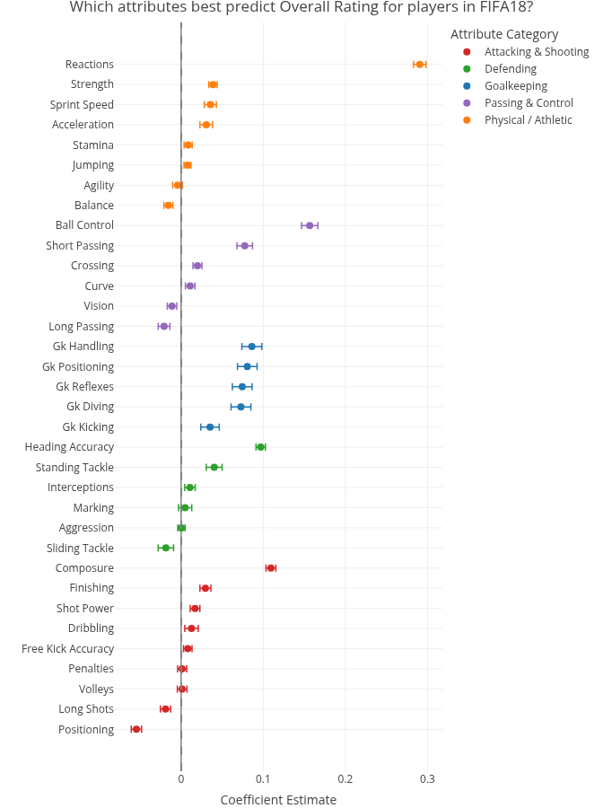

# Data Visualization and Reproducible Research

> Nathan Piel

The following is a sample of products created during the _"Data Visualization and Reproducible Research"_ course.

## Project 01

In the `project_01/` folder you can find an exploration in trends for U.S. births 
between 2000 and 2014 using daily birth count data. The goal is to tell a story about how 
birth patterns vary across different time scales (yearly, monthly, and by day of the week) and what events might explain those patterns. 

The dataset contains one row per day from January 1, 2000 through December 31, 2014. Each row includes the year, month, date of month, full date, day of week, and number of births recorded that day in the United States.

**Sample data visualization:**

## Project 02

In this project, I made an analysis of the FIFA 18 EA Sports dataset, which contains ratings for ~17,000 players across 34 performance attributes (e.g. acceleration, reactions, dribbling) alongside metadata like nationality, club, and age.

The goal is to explore how the 34 attributes relate to a player's overall rating, and to identify which players are over- or under-rated relative to what their attributes would predict.

**Sample data visualization:** 

## Project 03

In this project, I explored datasets for weather in Tampa and concrete strength.

The dataset for Tampa weather spans every day in 2022 with values for precipitation in inches, and maximum, minimum, and average temperatures in Fahrenheit.
With this dataset, I explored different ways to visualize the maximum temperatures and precipitation.

The dataset for concrete strength contains concrete samples with attributes including (but not limited to) age, cement content, water content, and compressive strength.
With this dataset, I explored the distributions of several attributes and compared the values to common concrete standards. 
In addition, I explored the relationship between age and compressive strength, and cement content and compressive strength.

**Sample data visualization:** 

### Moving Forward

In this course I learned about the grammar of graphics, how to make good looking graphs that show the right data, how to make data visualization interesting with storytelling, and how to do reproducible research.

For me, the most valuable parts of this course include learning how to make good graphs, choosing the right data to visualize, and data storytelling. 
Learning about graphing techniques is valuable not only for myself in the future when I might need to make good visualizations, 
but also for evaluating visualizations that I see in the news, articles, or the government (especially the government).
Some visualizations are bad, and I am glad that I am more equipped to see through the bad ones and appreciate the good ones. 

In addition, I appreciated the focus on data storytelling. When creating visualizations the most important part is often the story, 
not the visualization itself which is more like a complement to the story by providing an easy-to-read picture helps tell the story. 
This is something I had not thought about before, and I think it will help me in the future.
