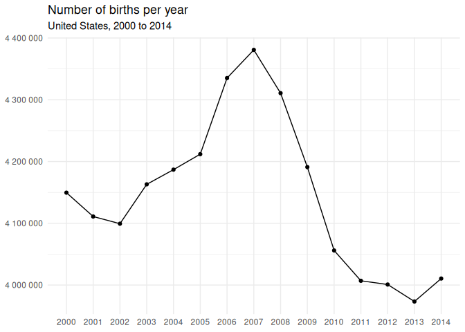
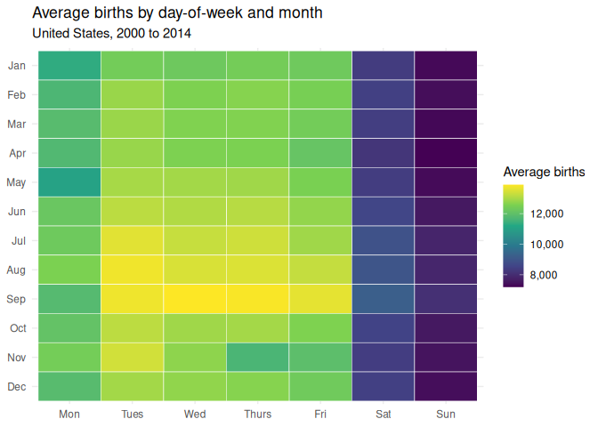

# Data Visualization Project 01

For this report, I am using the dataset with U.S. births data. Each row contains 
the number of births each day starting from 2000 through 2014. There's a column
for year, month, date of month, date in the yyyy-mm-dd format, day of week, and
the number of births.

With these data, I want to tell a story about different US birth patterns across various
time scales and what causes them. There are many different types of events
that affect the number of babies born during a particular time period. For example, long
nationwide events may affect the yearly births, but may be harder to see looking at
the monthly or daily births. There are also smaller events that just affect
the specific day that a baby is born. For example, holidays can affect the 
particular day of the month that a baby is born; there tends to be fewer babies
born on popular holidays. The day of the week can have the same effect; more babies
tend to be born on weekdays compared to weekends. In addition, some months are more 
popular birth months than others.

To do this, I chose to examine three patterns. The first visualization shows the total yearly 
births from 2000 through 2014. The second visualization shows the average births 
for each day of the month. The third visualization shows the average births for each
day of the week across every month.


``` r
library(tidyverse)
library(plotly)
```


``` r
births <- read_csv("../data/us_births_00_14.csv", show_col_types = FALSE)
```

# Number of births per year


``` r
yearly_births <- births |> 
  group_by(year) |> 
  summarize(births = sum(births)) |>
  mutate(tooltip = paste0(
    "<b>Year:</b> ", year, "<br>",
    "<b>Total Births:</b> ", scales::comma(births)
  ))

(ggplot(yearly_births, aes(year, births)) +
  geom_line(color = "#1F77B4", group = 1, linewidth = 1) + 
  geom_point(aes(text = tooltip), color = "#1F77B4", size = 2.5) +
  geom_vline(xintercept = 2007, linetype = "dashed", color = "#D32F2F", alpha = 0.7) +
  annotate("text", x = 2007.7, y = 4400000, label = "2007 Peak\n(4.38M)", hjust = 1, color = "#D32F2F", fontface = "bold", size = 3.5) +
  scale_x_continuous(breaks = 2000:2014, minor_breaks = NULL) +
  scale_y_continuous(labels = scales::label_number(scale = 1e-6, suffix = "M"), limits = c(3.8e6, 4.4e6)) +
  theme_minimal() +
  labs(title = "Number of births in the United States", 
       subtitle = "United States, 2000 to 2014",
       x = NULL, 
       y = "Number of U.S. births")) |> ggplotly(tooltip = "text")
```

```{=html}
<div class="plotly html-widget html-fill-item" id="htmlwidget-c53616a4df90612a183b" style="width:672px;height:480px;"></div>
<script type="application/json" data-for="htmlwidget-c53616a4df90612a183b">{"x":{"data":[{"x":[2000,2001,2002,2003,2004,2005,2006,2007,2008,2009,2010,2011,2012,2013,2014],"y":[4149598,4110963,4099313,4163060,4186863,4211941,4335154,4380784,4310737,4190991,4055975,4006908,4000868,3973337,4010532],"text":"","type":"scatter","mode":"lines","line":{"width":3.7795275590551185,"color":"rgba(31,119,180,1)","dash":"solid"},"hoveron":"points","showlegend":false,"xaxis":"x","yaxis":"y","hoverinfo":"text","frame":null},{"x":[2000,2001,2002,2003,2004,2005,2006,2007,2008,2009,2010,2011,2012,2013,2014],"y":[4149598,4110963,4099313,4163060,4186863,4211941,4335154,4380784,4310737,4190991,4055975,4006908,4000868,3973337,4010532],"text":["<b>Year:<\/b> 2000<br><b>Total Births:<\/b> 4,149,598","<b>Year:<\/b> 2001<br><b>Total Births:<\/b> 4,110,963","<b>Year:<\/b> 2002<br><b>Total Births:<\/b> 4,099,313","<b>Year:<\/b> 2003<br><b>Total Births:<\/b> 4,163,060","<b>Year:<\/b> 2004<br><b>Total Births:<\/b> 4,186,863","<b>Year:<\/b> 2005<br><b>Total Births:<\/b> 4,211,941","<b>Year:<\/b> 2006<br><b>Total Births:<\/b> 4,335,154","<b>Year:<\/b> 2007<br><b>Total Births:<\/b> 4,380,784","<b>Year:<\/b> 2008<br><b>Total Births:<\/b> 4,310,737","<b>Year:<\/b> 2009<br><b>Total Births:<\/b> 4,190,991","<b>Year:<\/b> 2010<br><b>Total Births:<\/b> 4,055,975","<b>Year:<\/b> 2011<br><b>Total Births:<\/b> 4,006,908","<b>Year:<\/b> 2012<br><b>Total Births:<\/b> 4,000,868","<b>Year:<\/b> 2013<br><b>Total Births:<\/b> 3,973,337","<b>Year:<\/b> 2014<br><b>Total Births:<\/b> 4,010,532"],"type":"scatter","mode":"markers","marker":{"autocolorscale":false,"color":"rgba(31,119,180,1)","opacity":1,"size":9.4488188976377963,"symbol":"circle","line":{"width":1.8897637795275593,"color":"rgba(31,119,180,1)"}},"hoveron":"points","showlegend":false,"xaxis":"x","yaxis":"y","hoverinfo":"text","frame":null},{"x":[2007,2007],"y":[3770000,4430000],"text":"","type":"scatter","mode":"lines","line":{"width":1.8897637795275593,"color":"rgba(211,47,47,0.7)","dash":"dash"},"hoveron":"points","showlegend":false,"xaxis":"x","yaxis":"y","hoverinfo":"text","frame":null},{"x":[2007.7],"y":[4400000],"text":"2007 Peak<br />(4.38M)","hovertext":"","textfont":{"size":13.228346456692915,"color":"rgba(211,47,47,1)"},"type":"scatter","mode":"text","hoveron":"points","showlegend":false,"xaxis":"x","yaxis":"y","hoverinfo":"text","frame":null}],"layout":{"margin":{"t":40.840182648401829,"r":7.3059360730593621,"b":22.648401826484022,"l":48.949771689497723},"paper_bgcolor":"rgba(255,255,255,1)","font":{"color":"rgba(0,0,0,1)","family":"","size":14.611872146118724},"title":{"text":"Number of births in the United States","font":{"color":"rgba(0,0,0,1)","family":"","size":17.534246575342465},"x":0,"xref":"paper"},"xaxis":{"domain":[0,1],"automargin":true,"type":"linear","autorange":false,"range":[1999.3,2014.7],"tickmode":"array","ticktext":["2000","2001","2002","2003","2004","2005","2006","2007","2008","2009","2010","2011","2012","2013","2014"],"tickvals":[2000,2001,2002,2003,2004,2005,2006,2007,2008,2009,2010,2011,2012,2013,2014],"categoryorder":"array","categoryarray":["2000","2001","2002","2003","2004","2005","2006","2007","2008","2009","2010","2011","2012","2013","2014"],"nticks":null,"ticks":"","tickcolor":null,"ticklen":3.6529680365296811,"tickwidth":0,"showticklabels":true,"tickfont":{"color":"rgba(77,77,77,1)","family":"","size":11.68949771689498},"tickangle":-0,"showline":false,"linecolor":null,"linewidth":0,"showgrid":true,"gridcolor":"rgba(235,235,235,1)","gridwidth":0.66417600664176002,"zeroline":false,"anchor":"y","title":{"text":"","font":{"color":"rgba(0,0,0,1)","family":"","size":14.611872146118724}},"hoverformat":".2f"},"yaxis":{"domain":[0,1],"automargin":true,"type":"linear","autorange":false,"range":[3770000,4430000],"tickmode":"array","ticktext":["3.8M","4.0M","4.2M","4.4M"],"tickvals":[3800000,4000000,4200000,4400000],"categoryorder":"array","categoryarray":["3.8M","4.0M","4.2M","4.4M"],"nticks":null,"ticks":"","tickcolor":null,"ticklen":3.6529680365296811,"tickwidth":0,"showticklabels":true,"tickfont":{"color":"rgba(77,77,77,1)","family":"","size":11.68949771689498},"tickangle":-0,"showline":false,"linecolor":null,"linewidth":0,"showgrid":true,"gridcolor":"rgba(235,235,235,1)","gridwidth":0.66417600664176002,"zeroline":false,"anchor":"x","title":{"text":"Number of U.S. births","font":{"color":"rgba(0,0,0,1)","family":"","size":14.611872146118724}},"hoverformat":".2f"},"shapes":[],"showlegend":false,"legend":{"bgcolor":null,"bordercolor":null,"borderwidth":0,"font":{"color":"rgba(0,0,0,1)","family":"","size":11.68949771689498}},"hovermode":"closest","barmode":"relative"},"config":{"doubleClick":"reset","modeBarButtonsToAdd":["hoverclosest","hovercompare"],"showSendToCloud":false},"source":"A","attrs":{"839850fab87e":{"x":{},"y":{},"type":"scatter"},"83986e1f2631":{"x":{},"y":{},"text":{}},"83987174b491":{"xintercept":{}},"8398743f5aea":{"x":{},"y":{}}},"cur_data":"839850fab87e","visdat":{"839850fab87e":["function (y) ","x"],"83986e1f2631":["function (y) ","x"],"83987174b491":["function (y) ","x"],"8398743f5aea":["function (y) ","x"]},"highlight":{"on":"plotly_click","persistent":false,"dynamic":false,"selectize":false,"opacityDim":0.20000000000000001,"selected":{"opacity":1},"debounce":0},"shinyEvents":["plotly_hover","plotly_click","plotly_selected","plotly_relayout","plotly_brushed","plotly_brushing","plotly_clickannotation","plotly_doubleclick","plotly_deselect","plotly_afterplot","plotly_sunburstclick"],"base_url":"https://plot.ly"},"evals":[],"jsHooks":[]}</script>
```

This is a line plot showing the relationship between the year on the x-axis, and
the number of births on the y-axis. We can see that between 2000 and 2014 there
was a baby boom peaking in 2007. There were over 200,000 more babies born in 
2007 compared to 2000. Starting in 2008, the number of births begins to fall off
linearly, reaching a low of about 4,000,000 in 2011, which holds stable through 2013. 
This low is over 100,000 less than in 2000. My first thought for the cause was the 
2008 financial crisis. I think this is a plausible but unconfirmed cause considering the start of
the fall in births began the same year, and began to level off after the worst
of the effects of the financial crisis had happened.

For the final revision of this graph, I added interactivity. Now when hovering
over a data point, the exact number of births for that year will be displayed.

I made some small improvements as well including adding a vertical line showing 
the peak number of births in 2007, increasing the thickness of the lines, abbreviating
the number of births, and adding an axis label. With these changes, the chart
looks better, is more self-contained, and shows the point of interest of this chart more clearly.

For comparison, this is the original graph:
<!-- -->

# Average births by date-of-month

``` r
dom <- c("Jan", "Feb", "Mar", "Apr", "May", "Jun", "Jul", "Aug", "Sep", "Oct", "Nov", "Dec")
new_births <- births |>
  summarize(births = mean(births), .by = c(date_of_month, month)) |>
  complete(date_of_month = 1:31, month = 1:12) |>
  mutate(
    overall_avg = mean(births, na.rm = TRUE),
    month = factor(month, levels=1:12, labels = dom),
    pct_diff = (births - overall_avg) / overall_avg * 100,
    tooltip = ifelse(is.na(births), 
                     paste0(""),
                     paste0(
                       "<b>", month, " ", date_of_month, "</b>",
                       ifelse(month == "Dec" & date_of_month == 25, ", <b>Christmas Day</b><br>", 
                              ifelse(month == "Jul" & date_of_month == 4, ", <b>Independence Day</b><br>",
                                     ifelse(month == 'Jan' & date_of_month == 1, ", <b>New Years' Day</b><br>",
                                            ifelse(month == 'Oct' & date_of_month == 31, ", <b>Halloween</b><br>",
                                                   ifelse(month == 'Nov' & date_of_month >= 22 & date_of_month <= 28, ", <b>Thanksgiving week</b><br>",
                                                          ifelse(month == 'Dec' & date_of_month == 31, ", <b>New Years' Eve</b><br>",
                                                                 ifelse(month == 'Dec' & date_of_month == 24, ", <b>Christmas Eve</b><br>",
                              "<br>"))))))),
                       "<b>Average births:</b> ", scales::comma(round(births)), "<br>",
                       "<b>Relative to Average:</b> ", 
                       ifelse(round(pct_diff, 1) == 0, "Equal to average", 
                              paste0(abs(round(pct_diff, 1)), "% ", 
                                     ifelse(pct_diff > 0, "above", "below"), " average"))
                     ))
  )
(new_births |>
  ggplot(aes(date_of_month, month, fill = births, text = tooltip)) +
  geom_tile(color="white") + 
  scale_x_continuous(breaks=1:31, minor_breaks = NULL) +
  scale_y_discrete(limits = rev) +
  scale_fill_viridis_c(labels=scales::label_comma(), na.value = "#EAEAEA") +
  theme_minimal() +
  labs(title = "Average births in the United States by day of month across every month",
       fill = "Average U.S. births",
       x = "Day of month",
       y = NULL)) |> ggplotly(tooltip = "text")
```

```{=html}
<div class="plotly html-widget html-fill-item" id="htmlwidget-b65a14a660f428eb2076" style="width:672px;height:480px;"></div>
<script type="application/json" data-for="htmlwidget-b65a14a660f428eb2076">{"x":{"data":[{"x":[1,2,3,4,5,6,7,8,9,10,11,12,13,14,15,16,17,18,19,20,21,22,23,24,25,26,27,28,29,30,31],"y":[1,2,3,4,5,6,7,8,9,10,11,12],"z":[[0.78011984416024416,0.76392182603540293,0.78893876513932426,0.77557804692131804,0.81653891759125941,0.77255018209536719,0.71970017786059126,0.71855678834589654,0.70667824172101301,0.7608198526297959,0.76444058609299581,0.87856779876344548,0.76464173795206247,0.755060557296519,0.7630007622596765,0.78008808334039137,0.8434509189463878,0.89295545015668687,0.95406326755314652,0.95308926907766589,0.87953121029897541,0.80016092148725337,0.62392013212501074,0.25353603794359275,0,0.54570381976793447,0.91334589650207509,0.91386465655966809,0.8940988396713816,0.87025705090200722,0.65281189125095285],[0.84401202676378417,0.78242779706953514,0.76441941221309406,0.75241382230879994,0.79565088506817994,0.79281358516134504,0.83690819005674599,0.80886338612687414,0.74753324299144586,0.74771322097061066,0.76351952231726938,0.78150673329380904,0.74034471076480068,0.83461082408740594,0.82537901245024159,0.7728995511137462,0.76379478275599222,0.76554162784788682,0.81179596849326674,0.86133226052341849,0.88407300753790119,0.67771237401541473,0.54589438468705009,0.56958795629711201,0.56226179385110542,0.62699034471076498,0.56769289404590495,0.64287075463707988,0.74638985347675102,0.73959303802828835,null],[0.87623867197425276,0.86791733717286379,0.89896883204878475,0.85499068349284324,0.80410985008893032,0.7828512746675701,0.77396883204878475,0.8088527991869231,0.79648725332429915,0.8861586347082242,0.82392860167697146,0.76689675616159925,0.69600660625052935,0.74874015414584583,0.80312526467349898,0.7973765562801729,0.84116413991699857,0.80729651901414434,0.73977301600745327,0.7455958329804353,0.73910603879054826,0.79044211061234881,0.78799652748369609,0.83924790378588976,0.81267468450918967,0.74812611162869491,0.74586050647920743,0.75209621411027372,0.76266198018124842,0.74189040399762873,0.60741509274159389],[0.71367620902854234,0.73386550351486424,0.74915304480393008,0.80426865418819349,0.8709346150588636,0.83949140340476014,0.84633056661302619,0.90283306513085482,0.93264588803252313,0.95388328957398161,0.8355530617430339,1,0.91643728296773119,0.91372702634030667,0.91477513339544347,0.89774074701448303,0.94460913017701376,0.95090835944778518,0.99376429236893371,0.96928728720250701,0.8946281866689253,0.88147920724993667,0.88666680782586604,0.91268950622512079,0.91582324045058028,0.95022020835097842,0.91056153129499462,0.83735284153468292,0.81904802235961738,0.80201363597865694,null],[0.91773947658168886,0.87194037435419669,0.81149953417464216,0.82051960701278914,0.8244685356144662,0.8516134496485136,0.87173922249513014,0.95028372999068367,0.89931820106716354,0.83354154315236739,0.83266282713644468,0.84256161599051416,0.83124417718302712,0.88469763699500314,0.94036376725671222,0.90644321165410346,0.84592826289489298,0.84107944439739157,0.82586601168798179,0.887090285423901,0.87764673498771939,0.92389048869314816,0.88499407131362762,0.82891505039383429,0.82857626831540632,0.82670237994410101,0.88046286101465254,0.91718895570424341,0.93699712035233362,0.90881468620310002,0.85550944355043645],[0.8602100448886254,0.89193910392140274,0.83401795545015689,0.37754086558821037,0.68310112645041077,0.8438849834843738,0.91765478106208187,0.87714914881002815,0.88580926568984519,0.89319894977555692,0.91939103921402576,0.86957948674515118,0.77826712966884048,0.83751164563394609,0.84250868129075995,0.88081223003303133,0.88621156940797841,0.91384348267976634,0.86175573812145345,0.82268992970271881,0.83797747099178455,0.82635301092572222,0.8665727957991024,0.87005589904294067,0.90416701956466528,0.86505886338612714,0.82174769204709086,0.82138773608876114,0.81498263741848065,0.85131701532988902,0.85340264250021169],[0.79169136952655228,0.7935758448378083,0.7623443719827222,0.79392521385618708,0.79670957906326756,0.8151732023375966,0.80034089946641829,0.76643093080376057,0.7466757008554249,0.75856483442025935,0.78152790717371068,0.80668247649699343,0.78929872109765398,0.82336749385957486,0.76793427627678512,0.77369357161006191,0.76993520792750081,0.81935504361819267,0.79684720928262898,0.86195688998052,0.82059371559244543,0.7722431608367919,0.77016812060641993,0.77150207504023061,0.82567544676886617,0.83144532904209367,0.88278140086389434,0.86729270771576195,0.81756585076649457,0.8180951977640385,null],[0.77147031422037782,0.79712246972135181,0.75700855424748026,0.69529728127382084,0.73584526128567795,0.7067523503006693,0.74342551029050574,0.76267256712119946,0.78451342423985782,0.78688489878885404,0.71593122723807923,0.72652875412890672,0.66938045227407483,0.76730964681968328,0.79360760565766075,0.82998433132887295,0.79081265351062935,0.73264800542051334,0.72597823325146105,0.75493351401710862,0.79937748793088859,0.81560726687558227,0.87154865757601452,0.82946557127127996,0.74010121114593053,0.61813966291183209,0.67042855932921164,0.68974972473956131,0.72551240789362259,0.7726348776149744,0.73004361819259767],[0.61583171000254078,0.76358304395697485,0.7595917675954944,0.82344160243923104,0.7631701532988906,0.6957631066316593,0.7040950283729992,0.70415855001270444,0.72765096976369947,0.74323494537139012,0.79262302024222941,0.76573219276700277,0.64519988142627271,0.70483611416956049,0.70419031083255712,0.74326670619124258,0.75122808503430172,0.7812844075548403,0.75354662488354374,0.70930380282883043,0.69668417040738539,0.69863216735834699,0.73007537901245045,0.74195392563733387,0.78467222833912098,0.75217032268992989,0.69888625391716774,0.69848395019903453,0.68204243245532326,0.71304099263148979,null],[0.79539679850935885,0.72280215126619807,0.74430422630642834,0.72115058863386139,0.748380198187516,0.75204327941051918,0.7947192343525028,0.76722495130007629,0.72126704497332106,0.72076945879562981,0.7078533920555603,0.75681798932836464,0.70854154315236739,0.79995976962818671,0.76763784195816054,0.71408909968662659,0.75210680105022443,0.71479842466333543,0.7427055983738462,0.77694376217498118,0.81018675362073345,0.76549928008808343,0.71476666384348264,0.71527483696112482,0.71970017786059126,0.73337850427712381,0.74955534852206329,0.79382993139662916,0.74221859913610566,0.70990725840603053,0.68884983484373696],[0.77153383586008306,0.73577115270602211,0.70600067756415696,0.74207038197679354,0.70745108833742709,0.73639578216312362,0.81581900567459986,0.78710722452782267,0.71697933429321603,0.72941898873549615,0.76027991869230127,0.74325611925129187,0.70285635639874644,0.88305666130261717,0.80704243245532326,0.72632760226984006,0.70425383247226236,0.74605107139832305,0.70002964343186258,0.7484331328872702,0.78271364444820868,0.79187134750571719,0.72376556280172799,0.70612772084356745,0.75194799695096126,0.70662530702125859,0.74087405776234461,0.78723426780723305,0.6398825908359449,null,null],[0.20604302532396032,0.50303845176590156,0.77863767256712135,0.79502625561107843,0.74229270771576195,0.71566655373930732,0.75224443126958584,0.70413737613280269,0.71218345049546883,0.79174430422630648,0.7805856695180825,0.73480774117049219,0.66402346065893114,0.76037520115185919,0.68531379690014416,0.70377742017447287,0.76979757770813939,0.76212204624375379,0.69106250529347002,0.69623951892944869,0.72151054459219111,0.70173414076395368,0.74857076310663162,0.79524858135004672,0.76918353519098859,0.71488312018294231,0.69902388413652916,0.72973659693402237,0.68522910138053694,0.72913314135682228,0.76666384348267991]],"text":[["<b>Dec 1<\/b><br><b>Average births:<\/b> 11,350<br><b>Relative to Average:<\/b> Equal to average","<b>Dec 2<\/b><br><b>Average births:<\/b> 11,248<br><b>Relative to Average:<\/b> 0.9% below average","<b>Dec 3<\/b><br><b>Average births:<\/b> 11,406<br><b>Relative to Average:<\/b> 0.5% above average","<b>Dec 4<\/b><br><b>Average births:<\/b> 11,322<br><b>Relative to Average:<\/b> 0.2% below average","<b>Dec 5<\/b><br><b>Average births:<\/b> 11,580<br><b>Relative to Average:<\/b> 2% above average","<b>Dec 6<\/b><br><b>Average births:<\/b> 11,303<br><b>Relative to Average:<\/b> 0.4% below average","<b>Dec 7<\/b><br><b>Average births:<\/b> 10,970<br><b>Relative to Average:<\/b> 3.3% below average","<b>Dec 8<\/b><br><b>Average births:<\/b> 10,963<br><b>Relative to Average:<\/b> 3.4% below average","<b>Dec 9<\/b><br><b>Average births:<\/b> 10,888<br><b>Relative to Average:<\/b> 4.1% below average","<b>Dec 10<\/b><br><b>Average births:<\/b> 11,229<br><b>Relative to Average:<\/b> 1.1% below average","<b>Dec 11<\/b><br><b>Average births:<\/b> 11,252<br><b>Relative to Average:<\/b> 0.9% below average","<b>Dec 12<\/b><br><b>Average births:<\/b> 11,970<br><b>Relative to Average:<\/b> 5.5% above average","<b>Dec 13<\/b><br><b>Average births:<\/b> 11,253<br><b>Relative to Average:<\/b> 0.8% below average","<b>Dec 14<\/b><br><b>Average births:<\/b> 11,193<br><b>Relative to Average:<\/b> 1.4% below average","<b>Dec 15<\/b><br><b>Average births:<\/b> 11,243<br><b>Relative to Average:<\/b> 0.9% below average","<b>Dec 16<\/b><br><b>Average births:<\/b> 11,350<br><b>Relative to Average:<\/b> Equal to average","<b>Dec 17<\/b><br><b>Average births:<\/b> 11,749<br><b>Relative to Average:<\/b> 3.5% above average","<b>Dec 18<\/b><br><b>Average births:<\/b> 12,061<br><b>Relative to Average:<\/b> 6.3% above average","<b>Dec 19<\/b><br><b>Average births:<\/b> 12,446<br><b>Relative to Average:<\/b> 9.7% above average","<b>Dec 20<\/b><br><b>Average births:<\/b> 12,440<br><b>Relative to Average:<\/b> 9.6% above average","<b>Dec 21<\/b><br><b>Average births:<\/b> 11,976<br><b>Relative to Average:<\/b> 5.5% above average","<b>Dec 22<\/b><br><b>Average births:<\/b> 11,477<br><b>Relative to Average:<\/b> 1.1% above average","<b>Dec 23<\/b><br><b>Average births:<\/b> 10,367<br><b>Relative to Average:<\/b> 8.6% below average","<b>Dec 24<\/b>, <b>Christmas Eve<\/b><br><b>Average births:<\/b> 8,034<br><b>Relative to Average:<\/b> 29.2% below average","<b>Dec 25<\/b>, <b>Christmas Day<\/b><br><b>Average births:<\/b> 6,438<br><b>Relative to Average:<\/b> 43.3% below average","<b>Dec 26<\/b><br><b>Average births:<\/b> 9,874<br><b>Relative to Average:<\/b> 13% below average","<b>Dec 27<\/b><br><b>Average births:<\/b> 12,189<br><b>Relative to Average:<\/b> 7.4% above average","<b>Dec 28<\/b><br><b>Average births:<\/b> 12,193<br><b>Relative to Average:<\/b> 7.4% above average","<b>Dec 29<\/b><br><b>Average births:<\/b> 12,068<br><b>Relative to Average:<\/b> 6.3% above average","<b>Dec 30<\/b><br><b>Average births:<\/b> 11,918<br><b>Relative to Average:<\/b> 5% above average","<b>Dec 31<\/b>, <b>New Years' Eve<\/b><br><b>Average births:<\/b> 10,549<br><b>Relative to Average:<\/b> 7% below average"],["<b>Nov 1<\/b><br><b>Average births:<\/b> 11,753<br><b>Relative to Average:<\/b> 3.6% above average","<b>Nov 2<\/b><br><b>Average births:<\/b> 11,365<br><b>Relative to Average:<\/b> 0.1% above average","<b>Nov 3<\/b><br><b>Average births:<\/b> 11,251<br><b>Relative to Average:<\/b> 0.9% below average","<b>Nov 4<\/b><br><b>Average births:<\/b> 11,176<br><b>Relative to Average:<\/b> 1.5% below average","<b>Nov 5<\/b><br><b>Average births:<\/b> 11,448<br><b>Relative to Average:<\/b> 0.9% above average","<b>Nov 6<\/b><br><b>Average births:<\/b> 11,430<br><b>Relative to Average:<\/b> 0.7% above average","<b>Nov 7<\/b><br><b>Average births:<\/b> 11,708<br><b>Relative to Average:<\/b> 3.2% above average","<b>Nov 8<\/b><br><b>Average births:<\/b> 11,531<br><b>Relative to Average:<\/b> 1.6% above average","<b>Nov 9<\/b><br><b>Average births:<\/b> 11,145<br><b>Relative to Average:<\/b> 1.8% below average","<b>Nov 10<\/b><br><b>Average births:<\/b> 11,146<br><b>Relative to Average:<\/b> 1.8% below average","<b>Nov 11<\/b><br><b>Average births:<\/b> 11,246<br><b>Relative to Average:<\/b> 0.9% below average","<b>Nov 12<\/b><br><b>Average births:<\/b> 11,359<br><b>Relative to Average:<\/b> 0.1% above average","<b>Nov 13<\/b><br><b>Average births:<\/b> 11,100<br><b>Relative to Average:<\/b> 2.2% below average","<b>Nov 14<\/b><br><b>Average births:<\/b> 11,693<br><b>Relative to Average:<\/b> 3% above average","<b>Nov 15<\/b><br><b>Average births:<\/b> 11,635<br><b>Relative to Average:<\/b> 2.5% above average","<b>Nov 16<\/b><br><b>Average births:<\/b> 11,305<br><b>Relative to Average:<\/b> 0.4% below average","<b>Nov 17<\/b><br><b>Average births:<\/b> 11,248<br><b>Relative to Average:<\/b> 0.9% below average","<b>Nov 18<\/b><br><b>Average births:<\/b> 11,259<br><b>Relative to Average:<\/b> 0.8% below average","<b>Nov 19<\/b><br><b>Average births:<\/b> 11,550<br><b>Relative to Average:<\/b> 1.8% above average","<b>Nov 20<\/b><br><b>Average births:<\/b> 11,862<br><b>Relative to Average:<\/b> 4.5% above average","<b>Nov 21<\/b><br><b>Average births:<\/b> 12,005<br><b>Relative to Average:<\/b> 5.8% above average","<b>Nov 22<\/b>, <b>Thanksgiving week<\/b><br><b>Average births:<\/b> 10,705<br><b>Relative to Average:<\/b> 5.7% below average","<b>Nov 23<\/b>, <b>Thanksgiving week<\/b><br><b>Average births:<\/b> 9,875<br><b>Relative to Average:<\/b> 13% below average","<b>Nov 24<\/b>, <b>Thanksgiving week<\/b><br><b>Average births:<\/b> 10,025<br><b>Relative to Average:<\/b> 11.7% below average","<b>Nov 25<\/b>, <b>Thanksgiving week<\/b><br><b>Average births:<\/b> 9,978<br><b>Relative to Average:<\/b> 12.1% below average","<b>Nov 26<\/b>, <b>Thanksgiving week<\/b><br><b>Average births:<\/b> 10,386<br><b>Relative to Average:<\/b> 8.5% below average","<b>Nov 27<\/b>, <b>Thanksgiving week<\/b><br><b>Average births:<\/b> 10,013<br><b>Relative to Average:<\/b> 11.8% below average","<b>Nov 28<\/b>, <b>Thanksgiving week<\/b><br><b>Average births:<\/b> 10,486<br><b>Relative to Average:<\/b> 7.6% below average","<b>Nov 29<\/b><br><b>Average births:<\/b> 11,138<br><b>Relative to Average:<\/b> 1.9% below average","<b>Nov 30<\/b><br><b>Average births:<\/b> 11,095<br><b>Relative to Average:<\/b> 2.2% below average",""],["<b>Oct 1<\/b><br><b>Average births:<\/b> 11,956<br><b>Relative to Average:<\/b> 5.4% above average","<b>Oct 2<\/b><br><b>Average births:<\/b> 11,903<br><b>Relative to Average:<\/b> 4.9% above average","<b>Oct 3<\/b><br><b>Average births:<\/b> 12,099<br><b>Relative to Average:<\/b> 6.6% above average","<b>Oct 4<\/b><br><b>Average births:<\/b> 11,822<br><b>Relative to Average:<\/b> 4.2% above average","<b>Oct 5<\/b><br><b>Average births:<\/b> 11,501<br><b>Relative to Average:<\/b> 1.3% above average","<b>Oct 6<\/b><br><b>Average births:<\/b> 11,368<br><b>Relative to Average:<\/b> 0.2% above average","<b>Oct 7<\/b><br><b>Average births:<\/b> 11,312<br><b>Relative to Average:<\/b> 0.3% below average","<b>Oct 8<\/b><br><b>Average births:<\/b> 11,531<br><b>Relative to Average:<\/b> 1.6% above average","<b>Oct 9<\/b><br><b>Average births:<\/b> 11,453<br><b>Relative to Average:<\/b> 0.9% above average","<b>Oct 10<\/b><br><b>Average births:<\/b> 12,018<br><b>Relative to Average:<\/b> 5.9% above average","<b>Oct 11<\/b><br><b>Average births:<\/b> 11,626<br><b>Relative to Average:<\/b> 2.4% above average","<b>Oct 12<\/b><br><b>Average births:<\/b> 11,267<br><b>Relative to Average:<\/b> 0.7% below average","<b>Oct 13<\/b><br><b>Average births:<\/b> 10,821<br><b>Relative to Average:<\/b> 4.6% below average","<b>Oct 14<\/b><br><b>Average births:<\/b> 11,153<br><b>Relative to Average:<\/b> 1.7% below average","<b>Oct 15<\/b><br><b>Average births:<\/b> 11,495<br><b>Relative to Average:<\/b> 1.3% above average","<b>Oct 16<\/b><br><b>Average births:<\/b> 11,459<br><b>Relative to Average:<\/b> 1% above average","<b>Oct 17<\/b><br><b>Average births:<\/b> 11,735<br><b>Relative to Average:<\/b> 3.4% above average","<b>Oct 18<\/b><br><b>Average births:<\/b> 11,521<br><b>Relative to Average:<\/b> 1.5% above average","<b>Oct 19<\/b><br><b>Average births:<\/b> 11,096<br><b>Relative to Average:<\/b> 2.2% below average","<b>Oct 20<\/b><br><b>Average births:<\/b> 11,133<br><b>Relative to Average:<\/b> 1.9% below average","<b>Oct 21<\/b><br><b>Average births:<\/b> 11,092<br><b>Relative to Average:<\/b> 2.3% below average","<b>Oct 22<\/b><br><b>Average births:<\/b> 11,415<br><b>Relative to Average:<\/b> 0.6% above average","<b>Oct 23<\/b><br><b>Average births:<\/b> 11,400<br><b>Relative to Average:<\/b> 0.5% above average","<b>Oct 24<\/b><br><b>Average births:<\/b> 11,723<br><b>Relative to Average:<\/b> 3.3% above average","<b>Oct 25<\/b><br><b>Average births:<\/b> 11,555<br><b>Relative to Average:<\/b> 1.8% above average","<b>Oct 26<\/b><br><b>Average births:<\/b> 11,149<br><b>Relative to Average:<\/b> 1.8% below average","<b>Oct 27<\/b><br><b>Average births:<\/b> 11,135<br><b>Relative to Average:<\/b> 1.9% below average","<b>Oct 28<\/b><br><b>Average births:<\/b> 11,174<br><b>Relative to Average:<\/b> 1.5% below average","<b>Oct 29<\/b><br><b>Average births:<\/b> 11,240<br><b>Relative to Average:<\/b> 1% below average","<b>Oct 30<\/b><br><b>Average births:<\/b> 11,110<br><b>Relative to Average:<\/b> 2.1% below average","<b>Oct 31<\/b>, <b>Halloween<\/b><br><b>Average births:<\/b> 10,263<br><b>Relative to Average:<\/b> 9.6% below average"],["<b>Sep 1<\/b><br><b>Average births:<\/b> 10,932<br><b>Relative to Average:<\/b> 3.7% below average","<b>Sep 2<\/b><br><b>Average births:<\/b> 11,059<br><b>Relative to Average:<\/b> 2.5% below average","<b>Sep 3<\/b><br><b>Average births:<\/b> 11,155<br><b>Relative to Average:<\/b> 1.7% below average","<b>Sep 4<\/b><br><b>Average births:<\/b> 11,502<br><b>Relative to Average:<\/b> 1.4% above average","<b>Sep 5<\/b><br><b>Average births:<\/b> 11,922<br><b>Relative to Average:<\/b> 5.1% above average","<b>Sep 6<\/b><br><b>Average births:<\/b> 11,724<br><b>Relative to Average:<\/b> 3.3% above average","<b>Sep 7<\/b><br><b>Average births:<\/b> 11,767<br><b>Relative to Average:<\/b> 3.7% above average","<b>Sep 8<\/b><br><b>Average births:<\/b> 12,123<br><b>Relative to Average:<\/b> 6.8% above average","<b>Sep 9<\/b><br><b>Average births:<\/b> 12,311<br><b>Relative to Average:<\/b> 8.5% above average","<b>Sep 10<\/b><br><b>Average births:<\/b> 12,445<br><b>Relative to Average:<\/b> 9.7% above average","<b>Sep 11<\/b><br><b>Average births:<\/b> 11,699<br><b>Relative to Average:<\/b> 3.1% above average","<b>Sep 12<\/b><br><b>Average births:<\/b> 12,735<br><b>Relative to Average:<\/b> 12.2% above average","<b>Sep 13<\/b><br><b>Average births:<\/b> 12,209<br><b>Relative to Average:<\/b> 7.6% above average","<b>Sep 14<\/b><br><b>Average births:<\/b> 12,192<br><b>Relative to Average:<\/b> 7.4% above average","<b>Sep 15<\/b><br><b>Average births:<\/b> 12,198<br><b>Relative to Average:<\/b> 7.5% above average","<b>Sep 16<\/b><br><b>Average births:<\/b> 12,091<br><b>Relative to Average:<\/b> 6.5% above average","<b>Sep 17<\/b><br><b>Average births:<\/b> 12,386<br><b>Relative to Average:<\/b> 9.1% above average","<b>Sep 18<\/b><br><b>Average births:<\/b> 12,426<br><b>Relative to Average:<\/b> 9.5% above average","<b>Sep 19<\/b><br><b>Average births:<\/b> 12,696<br><b>Relative to Average:<\/b> 11.9% above average","<b>Sep 20<\/b><br><b>Average births:<\/b> 12,542<br><b>Relative to Average:<\/b> 10.5% above average","<b>Sep 21<\/b><br><b>Average births:<\/b> 12,071<br><b>Relative to Average:<\/b> 6.4% above average","<b>Sep 22<\/b><br><b>Average births:<\/b> 11,989<br><b>Relative to Average:<\/b> 5.6% above average","<b>Sep 23<\/b><br><b>Average births:<\/b> 12,021<br><b>Relative to Average:<\/b> 5.9% above average","<b>Sep 24<\/b><br><b>Average births:<\/b> 12,185<br><b>Relative to Average:<\/b> 7.4% above average","<b>Sep 25<\/b><br><b>Average births:<\/b> 12,205<br><b>Relative to Average:<\/b> 7.5% above average","<b>Sep 26<\/b><br><b>Average births:<\/b> 12,421<br><b>Relative to Average:<\/b> 9.5% above average","<b>Sep 27<\/b><br><b>Average births:<\/b> 12,172<br><b>Relative to Average:<\/b> 7.3% above average","<b>Sep 28<\/b><br><b>Average births:<\/b> 11,711<br><b>Relative to Average:<\/b> 3.2% above average","<b>Sep 29<\/b><br><b>Average births:<\/b> 11,595<br><b>Relative to Average:<\/b> 2.2% above average","<b>Sep 30<\/b><br><b>Average births:<\/b> 11,488<br><b>Relative to Average:<\/b> 1.2% above average",""],["<b>Aug 1<\/b><br><b>Average births:<\/b> 12,217<br><b>Relative to Average:<\/b> 7.7% above average","<b>Aug 2<\/b><br><b>Average births:<\/b> 11,929<br><b>Relative to Average:<\/b> 5.1% above average","<b>Aug 3<\/b><br><b>Average births:<\/b> 11,548<br><b>Relative to Average:<\/b> 1.8% above average","<b>Aug 4<\/b><br><b>Average births:<\/b> 11,605<br><b>Relative to Average:<\/b> 2.3% above average","<b>Aug 5<\/b><br><b>Average births:<\/b> 11,630<br><b>Relative to Average:<\/b> 2.5% above average","<b>Aug 6<\/b><br><b>Average births:<\/b> 11,801<br><b>Relative to Average:<\/b> 4% above average","<b>Aug 7<\/b><br><b>Average births:<\/b> 11,927<br><b>Relative to Average:<\/b> 5.1% above average","<b>Aug 8<\/b><br><b>Average births:<\/b> 12,422<br><b>Relative to Average:<\/b> 9.5% above average","<b>Aug 9<\/b><br><b>Average births:<\/b> 12,101<br><b>Relative to Average:<\/b> 6.6% above average","<b>Aug 10<\/b><br><b>Average births:<\/b> 11,687<br><b>Relative to Average:<\/b> 3% above average","<b>Aug 11<\/b><br><b>Average births:<\/b> 11,681<br><b>Relative to Average:<\/b> 2.9% above average","<b>Aug 12<\/b><br><b>Average births:<\/b> 11,744<br><b>Relative to Average:<\/b> 3.5% above average","<b>Aug 13<\/b><br><b>Average births:<\/b> 11,672<br><b>Relative to Average:<\/b> 2.9% above average","<b>Aug 14<\/b><br><b>Average births:<\/b> 12,009<br><b>Relative to Average:<\/b> 5.8% above average","<b>Aug 15<\/b><br><b>Average births:<\/b> 12,359<br><b>Relative to Average:<\/b> 8.9% above average","<b>Aug 16<\/b><br><b>Average births:<\/b> 12,146<br><b>Relative to Average:<\/b> 7% above average","<b>Aug 17<\/b><br><b>Average births:<\/b> 11,765<br><b>Relative to Average:<\/b> 3.7% above average","<b>Aug 18<\/b><br><b>Average births:<\/b> 11,734<br><b>Relative to Average:<\/b> 3.4% above average","<b>Aug 19<\/b><br><b>Average births:<\/b> 11,638<br><b>Relative to Average:<\/b> 2.6% above average","<b>Aug 20<\/b><br><b>Average births:<\/b> 12,024<br><b>Relative to Average:<\/b> 6% above average","<b>Aug 21<\/b><br><b>Average births:<\/b> 11,964<br><b>Relative to Average:<\/b> 5.4% above average","<b>Aug 22<\/b><br><b>Average births:<\/b> 12,256<br><b>Relative to Average:<\/b> 8% above average","<b>Aug 23<\/b><br><b>Average births:<\/b> 12,011<br><b>Relative to Average:<\/b> 5.8% above average","<b>Aug 24<\/b><br><b>Average births:<\/b> 11,658<br><b>Relative to Average:<\/b> 2.7% above average","<b>Aug 25<\/b><br><b>Average births:<\/b> 11,655<br><b>Relative to Average:<\/b> 2.7% above average","<b>Aug 26<\/b><br><b>Average births:<\/b> 11,644<br><b>Relative to Average:<\/b> 2.6% above average","<b>Aug 27<\/b><br><b>Average births:<\/b> 11,982<br><b>Relative to Average:<\/b> 5.6% above average","<b>Aug 28<\/b><br><b>Average births:<\/b> 12,213<br><b>Relative to Average:<\/b> 7.6% above average","<b>Aug 29<\/b><br><b>Average births:<\/b> 12,338<br><b>Relative to Average:<\/b> 8.7% above average","<b>Aug 30<\/b><br><b>Average births:<\/b> 12,161<br><b>Relative to Average:<\/b> 7.2% above average","<b>Aug 31<\/b><br><b>Average births:<\/b> 11,825<br><b>Relative to Average:<\/b> 4.2% above average"],["<b>Jul 1<\/b><br><b>Average births:<\/b> 11,855<br><b>Relative to Average:<\/b> 4.5% above average","<b>Jul 2<\/b><br><b>Average births:<\/b> 12,054<br><b>Relative to Average:<\/b> 6.2% above average","<b>Jul 3<\/b><br><b>Average births:<\/b> 11,690<br><b>Relative to Average:<\/b> 3% above average","<b>Jul 4<\/b>, <b>Independence Day<\/b><br><b>Average births:<\/b> 8,815<br><b>Relative to Average:<\/b> 22.3% below average","<b>Jul 5<\/b><br><b>Average births:<\/b> 10,739<br><b>Relative to Average:<\/b> 5.4% below average","<b>Jul 6<\/b><br><b>Average births:<\/b> 11,752<br><b>Relative to Average:<\/b> 3.6% above average","<b>Jul 7<\/b><br><b>Average births:<\/b> 12,216<br><b>Relative to Average:<\/b> 7.6% above average","<b>Jul 8<\/b><br><b>Average births:<\/b> 11,961<br><b>Relative to Average:<\/b> 5.4% above average","<b>Jul 9<\/b><br><b>Average births:<\/b> 12,016<br><b>Relative to Average:<\/b> 5.9% above average","<b>Jul 10<\/b><br><b>Average births:<\/b> 12,062<br><b>Relative to Average:<\/b> 6.3% above average","<b>Jul 11<\/b><br><b>Average births:<\/b> 12,227<br><b>Relative to Average:<\/b> 7.7% above average","<b>Jul 12<\/b><br><b>Average births:<\/b> 11,914<br><b>Relative to Average:<\/b> 5% above average","<b>Jul 13<\/b><br><b>Average births:<\/b> 11,339<br><b>Relative to Average:<\/b> 0.1% below average","<b>Jul 14<\/b><br><b>Average births:<\/b> 11,712<br><b>Relative to Average:<\/b> 3.2% above average","<b>Jul 15<\/b><br><b>Average births:<\/b> 11,743<br><b>Relative to Average:<\/b> 3.5% above average","<b>Jul 16<\/b><br><b>Average births:<\/b> 11,984<br><b>Relative to Average:<\/b> 5.6% above average","<b>Jul 17<\/b><br><b>Average births:<\/b> 12,018<br><b>Relative to Average:<\/b> 5.9% above average","<b>Jul 18<\/b><br><b>Average births:<\/b> 12,192<br><b>Relative to Average:<\/b> 7.4% above average","<b>Jul 19<\/b><br><b>Average births:<\/b> 11,864<br><b>Relative to Average:<\/b> 4.5% above average","<b>Jul 20<\/b><br><b>Average births:<\/b> 11,618<br><b>Relative to Average:<\/b> 2.4% above average","<b>Jul 21<\/b><br><b>Average births:<\/b> 11,715<br><b>Relative to Average:<\/b> 3.2% above average","<b>Jul 22<\/b><br><b>Average births:<\/b> 11,641<br><b>Relative to Average:<\/b> 2.6% above average","<b>Jul 23<\/b><br><b>Average births:<\/b> 11,895<br><b>Relative to Average:<\/b> 4.8% above average","<b>Jul 24<\/b><br><b>Average births:<\/b> 11,917<br><b>Relative to Average:<\/b> 5% above average","<b>Jul 25<\/b><br><b>Average births:<\/b> 12,131<br><b>Relative to Average:<\/b> 6.9% above average","<b>Jul 26<\/b><br><b>Average births:<\/b> 11,885<br><b>Relative to Average:<\/b> 4.7% above average","<b>Jul 27<\/b><br><b>Average births:<\/b> 11,612<br><b>Relative to Average:<\/b> 2.3% above average","<b>Jul 28<\/b><br><b>Average births:<\/b> 11,610<br><b>Relative to Average:<\/b> 2.3% above average","<b>Jul 29<\/b><br><b>Average births:<\/b> 11,570<br><b>Relative to Average:<\/b> 2% above average","<b>Jul 30<\/b><br><b>Average births:<\/b> 11,799<br><b>Relative to Average:<\/b> 4% above average","<b>Jul 31<\/b><br><b>Average births:<\/b> 11,812<br><b>Relative to Average:<\/b> 4.1% above average"],["<b>Jun 1<\/b><br><b>Average births:<\/b> 11,423<br><b>Relative to Average:<\/b> 0.7% above average","<b>Jun 2<\/b><br><b>Average births:<\/b> 11,435<br><b>Relative to Average:<\/b> 0.8% above average","<b>Jun 3<\/b><br><b>Average births:<\/b> 11,238<br><b>Relative to Average:<\/b> 1% below average","<b>Jun 4<\/b><br><b>Average births:<\/b> 11,437<br><b>Relative to Average:<\/b> 0.8% above average","<b>Jun 5<\/b><br><b>Average births:<\/b> 11,455<br><b>Relative to Average:<\/b> 0.9% above average","<b>Jun 6<\/b><br><b>Average births:<\/b> 11,571<br><b>Relative to Average:<\/b> 2% above average","<b>Jun 7<\/b><br><b>Average births:<\/b> 11,478<br><b>Relative to Average:<\/b> 1.1% above average","<b>Jun 8<\/b><br><b>Average births:<\/b> 11,264<br><b>Relative to Average:<\/b> 0.7% below average","<b>Jun 9<\/b><br><b>Average births:<\/b> 11,140<br><b>Relative to Average:<\/b> 1.8% below average","<b>Jun 10<\/b><br><b>Average births:<\/b> 11,215<br><b>Relative to Average:<\/b> 1.2% below average","<b>Jun 11<\/b><br><b>Average births:<\/b> 11,359<br><b>Relative to Average:<\/b> 0.1% above average","<b>Jun 12<\/b><br><b>Average births:<\/b> 11,518<br><b>Relative to Average:<\/b> 1.5% above average","<b>Jun 13<\/b><br><b>Average births:<\/b> 11,408<br><b>Relative to Average:<\/b> 0.5% above average","<b>Jun 14<\/b><br><b>Average births:<\/b> 11,623<br><b>Relative to Average:<\/b> 2.4% above average","<b>Jun 15<\/b><br><b>Average births:<\/b> 11,274<br><b>Relative to Average:<\/b> 0.7% below average","<b>Jun 16<\/b><br><b>Average births:<\/b> 11,310<br><b>Relative to Average:<\/b> 0.3% below average","<b>Jun 17<\/b><br><b>Average births:<\/b> 11,286<br><b>Relative to Average:<\/b> 0.5% below average","<b>Jun 18<\/b><br><b>Average births:<\/b> 11,597<br><b>Relative to Average:<\/b> 2.2% above average","<b>Jun 19<\/b><br><b>Average births:<\/b> 11,456<br><b>Relative to Average:<\/b> 0.9% above average","<b>Jun 20<\/b><br><b>Average births:<\/b> 11,866<br><b>Relative to Average:<\/b> 4.6% above average","<b>Jun 21<\/b><br><b>Average births:<\/b> 11,605<br><b>Relative to Average:<\/b> 2.3% above average","<b>Jun 22<\/b><br><b>Average births:<\/b> 11,301<br><b>Relative to Average:<\/b> 0.4% below average","<b>Jun 23<\/b><br><b>Average births:<\/b> 11,288<br><b>Relative to Average:<\/b> 0.5% below average","<b>Jun 24<\/b><br><b>Average births:<\/b> 11,296<br><b>Relative to Average:<\/b> 0.5% below average","<b>Jun 25<\/b><br><b>Average births:<\/b> 11,637<br><b>Relative to Average:<\/b> 2.5% above average","<b>Jun 26<\/b><br><b>Average births:<\/b> 11,674<br><b>Relative to Average:<\/b> 2.9% above average","<b>Jun 27<\/b><br><b>Average births:<\/b> 11,997<br><b>Relative to Average:<\/b> 5.7% above average","<b>Jun 28<\/b><br><b>Average births:<\/b> 11,899<br><b>Relative to Average:<\/b> 4.9% above average","<b>Jun 29<\/b><br><b>Average births:<\/b> 11,586<br><b>Relative to Average:<\/b> 2.1% above average","<b>Jun 30<\/b><br><b>Average births:<\/b> 11,589<br><b>Relative to Average:<\/b> 2.1% above average",""],["<b>May 1<\/b><br><b>Average births:<\/b> 11,296<br><b>Relative to Average:<\/b> 0.5% below average","<b>May 2<\/b><br><b>Average births:<\/b> 11,457<br><b>Relative to Average:<\/b> 1% above average","<b>May 3<\/b><br><b>Average births:<\/b> 11,205<br><b>Relative to Average:<\/b> 1.3% below average","<b>May 4<\/b><br><b>Average births:<\/b> 10,816<br><b>Relative to Average:<\/b> 4.7% below average","<b>May 5<\/b><br><b>Average births:<\/b> 11,072<br><b>Relative to Average:<\/b> 2.4% below average","<b>May 6<\/b><br><b>Average births:<\/b> 10,888<br><b>Relative to Average:<\/b> 4.1% below average","<b>May 7<\/b><br><b>Average births:<\/b> 11,119<br><b>Relative to Average:<\/b> 2% below average","<b>May 8<\/b><br><b>Average births:<\/b> 11,240<br><b>Relative to Average:<\/b> 1% below average","<b>May 9<\/b><br><b>Average births:<\/b> 11,378<br><b>Relative to Average:<\/b> 0.3% above average","<b>May 10<\/b><br><b>Average births:<\/b> 11,393<br><b>Relative to Average:<\/b> 0.4% above average","<b>May 11<\/b><br><b>Average births:<\/b> 10,946<br><b>Relative to Average:<\/b> 3.5% below average","<b>May 12<\/b><br><b>Average births:<\/b> 11,013<br><b>Relative to Average:<\/b> 3% below average","<b>May 13<\/b><br><b>Average births:<\/b> 10,653<br><b>Relative to Average:<\/b> 6.1% below average","<b>May 14<\/b><br><b>Average births:<\/b> 11,270<br><b>Relative to Average:<\/b> 0.7% below average","<b>May 15<\/b><br><b>Average births:<\/b> 11,435<br><b>Relative to Average:<\/b> 0.8% above average","<b>May 16<\/b><br><b>Average births:<\/b> 11,664<br><b>Relative to Average:<\/b> 2.8% above average","<b>May 17<\/b><br><b>Average births:<\/b> 11,418<br><b>Relative to Average:<\/b> 0.6% above average","<b>May 18<\/b><br><b>Average births:<\/b> 11,051<br><b>Relative to Average:<\/b> 2.6% below average","<b>May 19<\/b><br><b>Average births:<\/b> 11,009<br><b>Relative to Average:<\/b> 3% below average","<b>May 20<\/b><br><b>Average births:<\/b> 11,192<br><b>Relative to Average:<\/b> 1.4% below average","<b>May 21<\/b><br><b>Average births:<\/b> 11,472<br><b>Relative to Average:<\/b> 1.1% above average","<b>May 22<\/b><br><b>Average births:<\/b> 11,574<br><b>Relative to Average:<\/b> 2% above average","<b>May 23<\/b><br><b>Average births:<\/b> 11,926<br><b>Relative to Average:<\/b> 5.1% above average","<b>May 24<\/b><br><b>Average births:<\/b> 11,661<br><b>Relative to Average:<\/b> 2.8% above average","<b>May 25<\/b><br><b>Average births:<\/b> 11,098<br><b>Relative to Average:<\/b> 2.2% below average","<b>May 26<\/b><br><b>Average births:<\/b> 10,330<br><b>Relative to Average:<\/b> 9% below average","<b>May 27<\/b><br><b>Average births:<\/b> 10,660<br><b>Relative to Average:<\/b> 6.1% below average","<b>May 28<\/b><br><b>Average births:<\/b> 10,781<br><b>Relative to Average:<\/b> 5% below average","<b>May 29<\/b><br><b>Average births:<\/b> 11,006<br><b>Relative to Average:<\/b> 3% below average","<b>May 30<\/b><br><b>Average births:<\/b> 11,303<br><b>Relative to Average:<\/b> 0.4% below average","<b>May 31<\/b><br><b>Average births:<\/b> 11,035<br><b>Relative to Average:<\/b> 2.8% below average"],["<b>Apr 1<\/b><br><b>Average births:<\/b> 10,316<br><b>Relative to Average:<\/b> 9.1% below average","<b>Apr 2<\/b><br><b>Average births:<\/b> 11,246<br><b>Relative to Average:<\/b> 0.9% below average","<b>Apr 3<\/b><br><b>Average births:<\/b> 11,221<br><b>Relative to Average:<\/b> 1.1% below average","<b>Apr 4<\/b><br><b>Average births:<\/b> 11,623<br><b>Relative to Average:<\/b> 2.4% above average","<b>Apr 5<\/b><br><b>Average births:<\/b> 11,244<br><b>Relative to Average:<\/b> 0.9% below average","<b>Apr 6<\/b><br><b>Average births:<\/b> 10,819<br><b>Relative to Average:<\/b> 4.7% below average","<b>Apr 7<\/b><br><b>Average births:<\/b> 10,872<br><b>Relative to Average:<\/b> 4.2% below average","<b>Apr 8<\/b><br><b>Average births:<\/b> 10,872<br><b>Relative to Average:<\/b> 4.2% below average","<b>Apr 9<\/b><br><b>Average births:<\/b> 11,020<br><b>Relative to Average:<\/b> 2.9% below average","<b>Apr 10<\/b><br><b>Average births:<\/b> 11,118<br><b>Relative to Average:<\/b> 2% below average","<b>Apr 11<\/b><br><b>Average births:<\/b> 11,429<br><b>Relative to Average:<\/b> 0.7% above average","<b>Apr 12<\/b><br><b>Average births:<\/b> 11,260<br><b>Relative to Average:<\/b> 0.8% below average","<b>Apr 13<\/b><br><b>Average births:<\/b> 10,501<br><b>Relative to Average:<\/b> 7.5% below average","<b>Apr 14<\/b><br><b>Average births:<\/b> 10,876<br><b>Relative to Average:<\/b> 4.2% below average","<b>Apr 15<\/b><br><b>Average births:<\/b> 10,872<br><b>Relative to Average:<\/b> 4.2% below average","<b>Apr 16<\/b><br><b>Average births:<\/b> 11,118<br><b>Relative to Average:<\/b> 2% below average","<b>Apr 17<\/b><br><b>Average births:<\/b> 11,168<br><b>Relative to Average:<\/b> 1.6% below average","<b>Apr 18<\/b><br><b>Average births:<\/b> 11,358<br><b>Relative to Average:<\/b> 0.1% above average","<b>Apr 19<\/b><br><b>Average births:<\/b> 11,183<br><b>Relative to Average:<\/b> 1.5% below average","<b>Apr 20<\/b><br><b>Average births:<\/b> 10,904<br><b>Relative to Average:<\/b> 3.9% below average","<b>Apr 21<\/b><br><b>Average births:<\/b> 10,825<br><b>Relative to Average:<\/b> 4.6% below average","<b>Apr 22<\/b><br><b>Average births:<\/b> 10,837<br><b>Relative to Average:<\/b> 4.5% below average","<b>Apr 23<\/b><br><b>Average births:<\/b> 11,035<br><b>Relative to Average:<\/b> 2.8% below average","<b>Apr 24<\/b><br><b>Average births:<\/b> 11,110<br><b>Relative to Average:<\/b> 2.1% below average","<b>Apr 25<\/b><br><b>Average births:<\/b> 11,379<br><b>Relative to Average:<\/b> 0.3% above average","<b>Apr 26<\/b><br><b>Average births:<\/b> 11,174<br><b>Relative to Average:<\/b> 1.5% below average","<b>Apr 27<\/b><br><b>Average births:<\/b> 10,839<br><b>Relative to Average:<\/b> 4.5% below average","<b>Apr 28<\/b><br><b>Average births:<\/b> 10,836<br><b>Relative to Average:<\/b> 4.5% below average","<b>Apr 29<\/b><br><b>Average births:<\/b> 10,733<br><b>Relative to Average:<\/b> 5.4% below average","<b>Apr 30<\/b><br><b>Average births:<\/b> 10,928<br><b>Relative to Average:<\/b> 3.7% below average",""],["<b>Mar 1<\/b><br><b>Average births:<\/b> 11,447<br><b>Relative to Average:<\/b> 0.9% above average","<b>Mar 2<\/b><br><b>Average births:<\/b> 10,989<br><b>Relative to Average:<\/b> 3.2% below average","<b>Mar 3<\/b><br><b>Average births:<\/b> 11,125<br><b>Relative to Average:<\/b> 2% below average","<b>Mar 4<\/b><br><b>Average births:<\/b> 10,979<br><b>Relative to Average:<\/b> 3.3% below average","<b>Mar 5<\/b><br><b>Average births:<\/b> 11,150<br><b>Relative to Average:<\/b> 1.7% below average","<b>Mar 6<\/b><br><b>Average births:<\/b> 11,174<br><b>Relative to Average:<\/b> 1.5% below average","<b>Mar 7<\/b><br><b>Average births:<\/b> 11,442<br><b>Relative to Average:<\/b> 0.8% above average","<b>Mar 8<\/b><br><b>Average births:<\/b> 11,269<br><b>Relative to Average:<\/b> 0.7% below average","<b>Mar 9<\/b><br><b>Average births:<\/b> 10,980<br><b>Relative to Average:<\/b> 3.2% below average","<b>Mar 10<\/b><br><b>Average births:<\/b> 10,977<br><b>Relative to Average:<\/b> 3.3% below average","<b>Mar 11<\/b><br><b>Average births:<\/b> 10,895<br><b>Relative to Average:<\/b> 4% below average","<b>Mar 12<\/b><br><b>Average births:<\/b> 11,204<br><b>Relative to Average:<\/b> 1.3% below average","<b>Mar 13<\/b><br><b>Average births:<\/b> 10,900<br><b>Relative to Average:<\/b> 4% below average","<b>Mar 14<\/b><br><b>Average births:<\/b> 11,475<br><b>Relative to Average:<\/b> 1.1% above average","<b>Mar 15<\/b><br><b>Average births:<\/b> 11,272<br><b>Relative to Average:<\/b> 0.7% below average","<b>Mar 16<\/b><br><b>Average births:<\/b> 10,935<br><b>Relative to Average:<\/b> 3.6% below average","<b>Mar 17<\/b><br><b>Average births:<\/b> 11,174<br><b>Relative to Average:<\/b> 1.5% below average","<b>Mar 18<\/b><br><b>Average births:<\/b> 10,939<br><b>Relative to Average:<\/b> 3.6% below average","<b>Mar 19<\/b><br><b>Average births:<\/b> 11,115<br><b>Relative to Average:<\/b> 2.1% below average","<b>Mar 20<\/b><br><b>Average births:<\/b> 11,330<br><b>Relative to Average:<\/b> 0.2% below average","<b>Mar 21<\/b><br><b>Average births:<\/b> 11,540<br><b>Relative to Average:<\/b> 1.7% above average","<b>Mar 22<\/b><br><b>Average births:<\/b> 11,258<br><b>Relative to Average:<\/b> 0.8% below average","<b>Mar 23<\/b><br><b>Average births:<\/b> 10,939<br><b>Relative to Average:<\/b> 3.6% below average","<b>Mar 24<\/b><br><b>Average births:<\/b> 10,942<br><b>Relative to Average:<\/b> 3.6% below average","<b>Mar 25<\/b><br><b>Average births:<\/b> 10,970<br><b>Relative to Average:<\/b> 3.3% below average","<b>Mar 26<\/b><br><b>Average births:<\/b> 11,056<br><b>Relative to Average:<\/b> 2.6% below average","<b>Mar 27<\/b><br><b>Average births:<\/b> 11,158<br><b>Relative to Average:<\/b> 1.7% below average","<b>Mar 28<\/b><br><b>Average births:<\/b> 11,437<br><b>Relative to Average:<\/b> 0.8% above average","<b>Mar 29<\/b><br><b>Average births:<\/b> 11,112<br><b>Relative to Average:<\/b> 2.1% below average","<b>Mar 30<\/b><br><b>Average births:<\/b> 10,908<br><b>Relative to Average:<\/b> 3.9% below average","<b>Mar 31<\/b><br><b>Average births:<\/b> 10,776<br><b>Relative to Average:<\/b> 5% below average"],["<b>Feb 1<\/b><br><b>Average births:<\/b> 11,296<br><b>Relative to Average:<\/b> 0.5% below average","<b>Feb 2<\/b><br><b>Average births:<\/b> 11,071<br><b>Relative to Average:<\/b> 2.4% below average","<b>Feb 3<\/b><br><b>Average births:<\/b> 10,884<br><b>Relative to Average:<\/b> 4.1% below average","<b>Feb 4<\/b><br><b>Average births:<\/b> 11,111<br><b>Relative to Average:<\/b> 2.1% below average","<b>Feb 5<\/b><br><b>Average births:<\/b> 10,893<br><b>Relative to Average:<\/b> 4% below average","<b>Feb 6<\/b><br><b>Average births:<\/b> 11,075<br><b>Relative to Average:<\/b> 2.4% below average","<b>Feb 7<\/b><br><b>Average births:<\/b> 11,575<br><b>Relative to Average:<\/b> 2% above average","<b>Feb 8<\/b><br><b>Average births:<\/b> 11,394<br><b>Relative to Average:<\/b> 0.4% above average","<b>Feb 9<\/b><br><b>Average births:<\/b> 10,953<br><b>Relative to Average:<\/b> 3.5% below average","<b>Feb 10<\/b><br><b>Average births:<\/b> 11,031<br><b>Relative to Average:<\/b> 2.8% below average","<b>Feb 11<\/b><br><b>Average births:<\/b> 11,225<br><b>Relative to Average:<\/b> 1.1% below average","<b>Feb 12<\/b><br><b>Average births:<\/b> 11,118<br><b>Relative to Average:<\/b> 2% below average","<b>Feb 13<\/b><br><b>Average births:<\/b> 10,864<br><b>Relative to Average:<\/b> 4.3% below average","<b>Feb 14<\/b><br><b>Average births:<\/b> 11,999<br><b>Relative to Average:<\/b> 5.7% above average","<b>Feb 15<\/b><br><b>Average births:<\/b> 11,520<br><b>Relative to Average:<\/b> 1.5% above average","<b>Feb 16<\/b><br><b>Average births:<\/b> 11,012<br><b>Relative to Average:<\/b> 3% below average","<b>Feb 17<\/b><br><b>Average births:<\/b> 10,873<br><b>Relative to Average:<\/b> 4.2% below average","<b>Feb 18<\/b><br><b>Average births:<\/b> 11,136<br><b>Relative to Average:<\/b> 1.9% below average","<b>Feb 19<\/b><br><b>Average births:<\/b> 10,846<br><b>Relative to Average:<\/b> 4.4% below average","<b>Feb 20<\/b><br><b>Average births:<\/b> 11,151<br><b>Relative to Average:<\/b> 1.7% below average","<b>Feb 21<\/b><br><b>Average births:<\/b> 11,367<br><b>Relative to Average:<\/b> 0.2% above average","<b>Feb 22<\/b><br><b>Average births:<\/b> 11,424<br><b>Relative to Average:<\/b> 0.7% above average","<b>Feb 23<\/b><br><b>Average births:<\/b> 10,995<br><b>Relative to Average:<\/b> 3.1% below average","<b>Feb 24<\/b><br><b>Average births:<\/b> 10,884<br><b>Relative to Average:<\/b> 4.1% below average","<b>Feb 25<\/b><br><b>Average births:<\/b> 11,173<br><b>Relative to Average:<\/b> 1.5% below average","<b>Feb 26<\/b><br><b>Average births:<\/b> 10,888<br><b>Relative to Average:<\/b> 4.1% below average","<b>Feb 27<\/b><br><b>Average births:<\/b> 11,103<br><b>Relative to Average:<\/b> 2.2% below average","<b>Feb 28<\/b><br><b>Average births:<\/b> 11,395<br><b>Relative to Average:<\/b> 0.4% above average","<b>Feb 29<\/b><br><b>Average births:<\/b> 10,467<br><b>Relative to Average:<\/b> 7.8% below average","",""],["<b>Jan 1<\/b>, <b>New Years' Day<\/b><br><b>Average births:<\/b> 7,735<br><b>Relative to Average:<\/b> 31.8% below average","<b>Jan 2<\/b><br><b>Average births:<\/b> 9,606<br><b>Relative to Average:<\/b> 15.4% below average","<b>Jan 3<\/b><br><b>Average births:<\/b> 11,341<br><b>Relative to Average:<\/b> 0.1% below average","<b>Jan 4<\/b><br><b>Average births:<\/b> 11,444<br><b>Relative to Average:<\/b> 0.8% above average","<b>Jan 5<\/b><br><b>Average births:<\/b> 11,112<br><b>Relative to Average:<\/b> 2.1% below average","<b>Jan 6<\/b><br><b>Average births:<\/b> 10,944<br><b>Relative to Average:<\/b> 3.6% below average","<b>Jan 7<\/b><br><b>Average births:<\/b> 11,175<br><b>Relative to Average:<\/b> 1.5% below average","<b>Jan 8<\/b><br><b>Average births:<\/b> 10,872<br><b>Relative to Average:<\/b> 4.2% below average","<b>Jan 9<\/b><br><b>Average births:<\/b> 10,923<br><b>Relative to Average:<\/b> 3.8% below average","<b>Jan 10<\/b><br><b>Average births:<\/b> 11,424<br><b>Relative to Average:<\/b> 0.7% above average","<b>Jan 11<\/b><br><b>Average births:<\/b> 11,353<br><b>Relative to Average:<\/b> Equal to average","<b>Jan 12<\/b><br><b>Average births:<\/b> 11,065<br><b>Relative to Average:<\/b> 2.5% below average","<b>Jan 13<\/b><br><b>Average births:<\/b> 10,619<br><b>Relative to Average:<\/b> 6.4% below average","<b>Jan 14<\/b><br><b>Average births:<\/b> 11,226<br><b>Relative to Average:<\/b> 1.1% below average","<b>Jan 15<\/b><br><b>Average births:<\/b> 10,753<br><b>Relative to Average:<\/b> 5.2% below average","<b>Jan 16<\/b><br><b>Average births:<\/b> 10,870<br><b>Relative to Average:<\/b> 4.2% below average","<b>Jan 17<\/b><br><b>Average births:<\/b> 11,285<br><b>Relative to Average:<\/b> 0.6% below average","<b>Jan 18<\/b><br><b>Average births:<\/b> 11,237<br><b>Relative to Average:<\/b> 1% below average","<b>Jan 19<\/b><br><b>Average births:<\/b> 10,790<br><b>Relative to Average:<\/b> 4.9% below average","<b>Jan 20<\/b><br><b>Average births:<\/b> 10,822<br><b>Relative to Average:<\/b> 4.6% below average","<b>Jan 21<\/b><br><b>Average births:<\/b> 10,981<br><b>Relative to Average:<\/b> 3.2% below average","<b>Jan 22<\/b><br><b>Average births:<\/b> 10,857<br><b>Relative to Average:<\/b> 4.3% below average","<b>Jan 23<\/b><br><b>Average births:<\/b> 11,152<br><b>Relative to Average:<\/b> 1.7% below average","<b>Jan 24<\/b><br><b>Average births:<\/b> 11,446<br><b>Relative to Average:<\/b> 0.9% above average","<b>Jan 25<\/b><br><b>Average births:<\/b> 11,281<br><b>Relative to Average:<\/b> 0.6% below average","<b>Jan 26<\/b><br><b>Average births:<\/b> 10,940<br><b>Relative to Average:<\/b> 3.6% below average","<b>Jan 27<\/b><br><b>Average births:<\/b> 10,840<br><b>Relative to Average:<\/b> 4.5% below average","<b>Jan 28<\/b><br><b>Average births:<\/b> 11,033<br><b>Relative to Average:<\/b> 2.8% below average","<b>Jan 29<\/b><br><b>Average births:<\/b> 10,753<br><b>Relative to Average:<\/b> 5.2% below average","<b>Jan 30<\/b><br><b>Average births:<\/b> 11,029<br><b>Relative to Average:<\/b> 2.8% below average","<b>Jan 31<\/b><br><b>Average births:<\/b> 11,266<br><b>Relative to Average:<\/b> 0.7% below average"]],"colorscale":[[0,"#440154"],[0.20604302532396032,"#414687"],[0.25353603794359275,"#3F5289"],[0.37754086558821037,"#2F728D"],[0.50303845176590156,"#2B9089"],[0.54570381976793447,"#289B87"],[0.54589438468705009,"#289B87"],[0.56226179385110542,"#279F86"],[0.56769289404590495,"#26A086"],[0.56958795629711201,"#26A186"],[0.60741509274159389,"#29A982"],[0.61583171000254078,"#30AB81"],[0.61813966291183209,"#31AC80"],[0.62392013212501074,"#35AD7F"],[0.62699034471076498,"#37AD7E"],[0.6398825908359449,"#3FB07B"],[0.64287075463707988,"#40B17B"],[0.64519988142627271,"#42B17A"],[0.65281189125095285,"#45B378"],[0.66402346065893114,"#4BB576"],[0.66938045227407483,"#4DB674"],[0.67042855932921164,"#4EB674"],[0.67771237401541473,"#51B872"],[0.68204243245532326,"#53B871"],[0.68310112645041077,"#53B971"],[0.68522910138053694,"#54B971"],[0.68531379690014416,"#54B971"],[0.68884983484373696,"#55BA70"],[0.68974972473956131,"#56BA70"],[0.69106250529347002,"#56BA6F"],[0.69529728127382084,"#58BB6E"],[0.6957631066316593,"#58BB6E"],[0.69600660625052935,"#58BB6E"],[0.69623951892944869,"#58BB6E"],[0.69668417040738539,"#58BB6E"],[0.69848395019903453,"#59BC6D"],[0.69863216735834699,"#59BC6D"],[0.69888625391716774,"#59BC6D"],[0.69902388413652916,"#59BC6D"],[0.70002964343186258,"#5ABC6D"],[0.70173414076395368,"#5ABD6D"],[0.70285635639874644,"#5BBD6C"],[0.70377742017447287,"#5BBD6C"],[0.7040950283729992,"#5BBD6C"],[0.70413737613280269,"#5BBD6C"],[0.70415855001270444,"#5BBD6C"],[0.70419031083255712,"#5BBD6C"],[0.70425383247226236,"#5BBD6C"],[0.70483611416956049,"#5BBD6C"],[0.70600067756415696,"#5CBD6C"],[0.70612772084356745,"#5CBD6B"],[0.70662530702125859,"#5CBE6B"],[0.70667824172101301,"#5CBE6B"],[0.7067523503006693,"#5CBE6B"],[0.70745108833742709,"#5CBE6B"],[0.7078533920555603,"#5DBE6B"],[0.70854154315236739,"#5DBE6B"],[0.70930380282883043,"#5DBE6B"],[0.70990725840603053,"#5DBE6B"],[0.71218345049546883,"#5EBF6A"],[0.71304099263148979,"#5EBF6A"],[0.71367620902854234,"#5FBF6A"],[0.71408909968662659,"#5FBF69"],[0.71476666384348264,"#5FBF69"],[0.71479842466333543,"#5FBF69"],[0.71488312018294231,"#5FBF69"],[0.71527483696112482,"#5FBF69"],[0.71566655373930732,"#5FBF69"],[0.71593122723807923,"#60BF69"],[0.71697933429321603,"#60C069"],[0.71855678834589654,"#60C068"],[0.71970017786059126,"#61C068"],[0.72076945879562981,"#61C068"],[0.72115058863386139,"#61C168"],[0.72126704497332106,"#61C168"],[0.72151054459219111,"#61C168"],[0.72280215126619807,"#62C167"],[0.72376556280172799,"#62C167"],[0.72551240789362259,"#63C167"],[0.72597823325146105,"#63C266"],[0.72632760226984006,"#63C266"],[0.72652875412890672,"#63C266"],[0.72765096976369947,"#64C266"],[0.72913314135682228,"#64C266"],[0.72941898873549615,"#64C266"],[0.72973659693402237,"#64C265"],[0.73004361819259767,"#64C265"],[0.73007537901245045,"#64C265"],[0.73264800542051334,"#65C365"],[0.73337850427712381,"#66C364"],[0.73386550351486424,"#66C364"],[0.73480774117049219,"#66C364"],[0.73577115270602211,"#66C464"],[0.73584526128567795,"#66C464"],[0.73639578216312362,"#67C464"],[0.73910603879054826,"#67C463"],[0.73959303802828835,"#68C463"],[0.73977301600745327,"#68C463"],[0.74010121114593053,"#68C463"],[0.74034471076480068,"#68C463"],[0.74087405776234461,"#68C562"],[0.74189040399762873,"#68C562"],[0.74195392563733387,"#68C562"],[0.74207038197679354,"#68C562"],[0.74221859913610566,"#68C562"],[0.74229270771576195,"#68C562"],[0.7427055983738462,"#69C562"],[0.74323494537139012,"#69C562"],[0.74325611925129187,"#69C562"],[0.74326670619124258,"#69C562"],[0.74342551029050574,"#69C562"],[0.74430422630642834,"#69C562"],[0.7455958329804353,"#6AC661"],[0.74586050647920743,"#6AC661"],[0.74605107139832305,"#6AC661"],[0.74638985347675102,"#6AC661"],[0.7466757008554249,"#6AC661"],[0.74753324299144586,"#6AC661"],[0.74771322097061066,"#6AC661"],[0.74812611162869491,"#6AC660"],[0.748380198187516,"#6AC660"],[0.7484331328872702,"#6AC660"],[0.74857076310663162,"#6BC660"],[0.74874015414584583,"#6BC660"],[0.74915304480393008,"#6BC660"],[0.74955534852206329,"#6BC660"],[0.75122808503430172,"#6BC760"],[0.75194799695096126,"#6CC75F"],[0.75204327941051918,"#6CC75F"],[0.75209621411027372,"#6CC75F"],[0.75210680105022443,"#6CC75F"],[0.75217032268992989,"#6CC75F"],[0.75224443126958584,"#6CC75F"],[0.75241382230879994,"#6CC75F"],[0.75354662488354374,"#6CC75F"],[0.75493351401710862,"#6DC85F"],[0.755060557296519,"#6DC85F"],[0.75681798932836464,"#6DC85E"],[0.75700855424748026,"#6DC85E"],[0.75856483442025935,"#6EC85E"],[0.7595917675954944,"#6EC95D"],[0.76027991869230127,"#6EC95D"],[0.76037520115185919,"#6EC95D"],[0.7608198526297959,"#6EC95D"],[0.76212204624375379,"#6FC95D"],[0.7623443719827222,"#6FC95C"],[0.76266198018124842,"#6FC95C"],[0.76267256712119946,"#6FC95C"],[0.7630007622596765,"#6FC95C"],[0.7631701532988906,"#6FC95C"],[0.76351952231726938,"#6FC95C"],[0.76358304395697485,"#6FC95C"],[0.76379478275599222,"#6FC95C"],[0.76392182603540293,"#6FC95C"],[0.76441941221309406,"#70CA5C"],[0.76444058609299581,"#70CA5C"],[0.76464173795206247,"#70CA5C"],[0.76549928008808343,"#70CA5C"],[0.76554162784788682,"#70CA5C"],[0.76573219276700277,"#70CA5B"],[0.76643093080376057,"#70CA5B"],[0.76666384348267991,"#70CA5B"],[0.76689675616159925,"#70CA5B"],[0.76722495130007629,"#70CA5B"],[0.76730964681968328,"#70CA5B"],[0.76763784195816054,"#70CA5B"],[0.76793427627678512,"#71CA5B"],[0.76918353519098859,"#71CB5A"],[0.76979757770813939,"#71CB5A"],[0.76993520792750081,"#71CB5A"],[0.77016812060641993,"#71CB5A"],[0.77147031422037782,"#72CB5A"],[0.77150207504023061,"#72CB5A"],[0.77153383586008306,"#72CB5A"],[0.7722431608367919,"#72CB5A"],[0.77255018209536719,"#72CB59"],[0.7726348776149744,"#72CB59"],[0.7728995511137462,"#72CB59"],[0.77369357161006191,"#72CB59"],[0.77396883204878475,"#72CC59"],[0.77557804692131804,"#73CC59"],[0.77694376217498118,"#73CC58"],[0.77826712966884048,"#74CC58"],[0.77863767256712135,"#74CC58"],[0.78008808334039137,"#74CD57"],[0.78011984416024416,"#74CD57"],[0.7805856695180825,"#74CD57"],[0.7812844075548403,"#75CD57"],[0.78150673329380904,"#75CD57"],[0.78152790717371068,"#75CD57"],[0.78242779706953514,"#75CD57"],[0.78271364444820868,"#75CD56"],[0.7828512746675701,"#75CD56"],[0.78451342423985782,"#76CE56"],[0.78467222833912098,"#76CE56"],[0.78688489878885404,"#76CE55"],[0.78710722452782267,"#76CE55"],[0.78723426780723305,"#76CE55"],[0.78799652748369609,"#77CE55"],[0.78893876513932426,"#77CF55"],[0.78929872109765398,"#77CF54"],[0.79044211061234881,"#77CF54"],[0.79081265351062935,"#77CF54"],[0.79169136952655228,"#78CF54"],[0.79174430422630648,"#78CF54"],[0.79187134750571719,"#78CF54"],[0.79262302024222941,"#78CF53"],[0.79281358516134504,"#78CF53"],[0.7935758448378083,"#78D053"],[0.79360760565766075,"#78D053"],[0.79382993139662916,"#78D053"],[0.79392521385618708,"#78D053"],[0.7947192343525028,"#78D053"],[0.79502625561107843,"#79D053"],[0.79524858135004672,"#79D053"],[0.79539679850935885,"#79D052"],[0.79565088506817994,"#79D052"],[0.79648725332429915,"#79D052"],[0.79670957906326756,"#79D052"],[0.79684720928262898,"#79D052"],[0.79712246972135181,"#79D052"],[0.7973765562801729,"#79D052"],[0.79937748793088859,"#7AD151"],[0.79995976962818671,"#7AD151"],[0.80016092148725337,"#7AD151"],[0.80034089946641829,"#7AD151"],[0.80201363597865694,"#7CD151"],[0.80312526467349898,"#7DD151"],[0.80410985008893032,"#7DD250"],[0.80426865418819349,"#7DD250"],[0.80668247649699343,"#7FD250"],[0.80704243245532326,"#80D250"],[0.80729651901414434,"#80D250"],[0.8088527991869231,"#81D250"],[0.80886338612687414,"#81D250"],[0.81018675362073345,"#82D24F"],[0.81149953417464216,"#83D24F"],[0.81179596849326674,"#83D24F"],[0.81267468450918967,"#84D34F"],[0.81498263741848065,"#86D34F"],[0.8151732023375966,"#86D34F"],[0.81560726687558227,"#86D34F"],[0.81581900567459986,"#86D34F"],[0.81653891759125941,"#87D34E"],[0.81756585076649457,"#88D34E"],[0.8180951977640385,"#88D34E"],[0.81904802235961738,"#89D34E"],[0.81935504361819267,"#89D34E"],[0.82051960701278914,"#8AD44E"],[0.82059371559244543,"#8AD44E"],[0.82138773608876114,"#8BD44E"],[0.82174769204709086,"#8BD44E"],[0.82268992970271881,"#8CD44D"],[0.82336749385957486,"#8CD44D"],[0.82344160243923104,"#8CD44D"],[0.82392860167697146,"#8DD44D"],[0.8244685356144662,"#8DD44D"],[0.82537901245024159,"#8ED44D"],[0.82567544676886617,"#8ED44D"],[0.82586601168798179,"#8ED44D"],[0.82635301092572222,"#8ED44D"],[0.82670237994410101,"#8FD44D"],[0.82857626831540632,"#90D54D"],[0.82891505039383429,"#90D54C"],[0.82946557127127996,"#91D54C"],[0.82998433132887295,"#91D54C"],[0.83124417718302712,"#92D54C"],[0.83144532904209367,"#92D54C"],[0.83266282713644468,"#93D54C"],[0.83354154315236739,"#94D54C"],[0.83401795545015689,"#94D54C"],[0.83461082408740594,"#94D54C"],[0.8355530617430339,"#95D54B"],[0.83690819005674599,"#96D64B"],[0.83735284153468292,"#96D64B"],[0.83751164563394609,"#96D64B"],[0.83797747099178455,"#97D64B"],[0.83924790378588976,"#98D64B"],[0.83949140340476014,"#98D64B"],[0.84107944439739157,"#99D64B"],[0.84116413991699857,"#99D64A"],[0.84250868129075995,"#9AD64A"],[0.84256161599051416,"#9AD64A"],[0.8434509189463878,"#9BD64A"],[0.8438849834843738,"#9BD64A"],[0.84401202676378417,"#9BD64A"],[0.84592826289489298,"#9CD74A"],[0.84633056661302619,"#9DD74A"],[0.85131701532988902,"#A0D749"],[0.8516134496485136,"#A0D749"],[0.85340264250021169,"#A2D848"],[0.85499068349284324,"#A3D848"],[0.85550944355043645,"#A3D848"],[0.8602100448886254,"#A6D847"],[0.86133226052341849,"#A7D847"],[0.86175573812145345,"#A7D947"],[0.86195688998052,"#A7D947"],[0.86505886338612714,"#A9D946"],[0.8665727957991024,"#AAD946"],[0.86729270771576195,"#ABD946"],[0.86791733717286379,"#ABD946"],[0.86957948674515118,"#ACD946"],[0.87005589904294067,"#ADD945"],[0.87025705090200722,"#ADD945"],[0.8709346150588636,"#ADDA45"],[0.87154865757601452,"#AEDA45"],[0.87173922249513014,"#AEDA45"],[0.87194037435419669,"#AEDA45"],[0.87623867197425276,"#B1DA44"],[0.87714914881002815,"#B1DA44"],[0.87764673498771939,"#B2DA44"],[0.87856779876344548,"#B2DA44"],[0.87953121029897541,"#B3DB44"],[0.88046286101465254,"#B4DB44"],[0.88081223003303133,"#B4DB43"],[0.88147920724993667,"#B4DB43"],[0.88278140086389434,"#B5DB43"],[0.88305666130261717,"#B5DB43"],[0.88407300753790119,"#B6DB43"],[0.88469763699500314,"#B6DB43"],[0.88499407131362762,"#B7DB43"],[0.88580926568984519,"#B7DB42"],[0.8861586347082242,"#B7DB42"],[0.88621156940797841,"#B7DB42"],[0.88666680782586604,"#B8DB42"],[0.887090285423901,"#B8DB42"],[0.89193910392140274,"#BBDC41"],[0.89295545015668687,"#BCDC41"],[0.89319894977555692,"#BCDC41"],[0.8940988396713816,"#BCDC41"],[0.8946281866689253,"#BDDC41"],[0.89774074701448303,"#BFDD40"],[0.89896883204878475,"#C0DD40"],[0.89931820106716354,"#C0DD40"],[0.90283306513085482,"#C2DD3F"],[0.90416701956466528,"#C3DD3F"],[0.90644321165410346,"#C4DE3E"],[0.90881468620310002,"#C6DE3E"],[0.91056153129499462,"#C7DE3D"],[0.91268950622512079,"#C8DE3D"],[0.91334589650207509,"#C9DE3D"],[0.91372702634030667,"#C9DE3D"],[0.91384348267976634,"#C9DE3D"],[0.91386465655966809,"#C9DE3D"],[0.91477513339544347,"#CADE3D"],[0.91582324045058028,"#CADF3C"],[0.91643728296773119,"#CBDF3C"],[0.91718895570424341,"#CBDF3C"],[0.91765478106208187,"#CBDF3C"],[0.91773947658168886,"#CBDF3C"],[0.91939103921402576,"#CCDF3C"],[0.92389048869314816,"#CFDF3B"],[0.93264588803252313,"#D5E039"],[0.93699712035233362,"#D7E138"],[0.94036376725671222,"#D9E137"],[0.94460913017701376,"#DCE236"],[0.95022020835097842,"#DFE234"],[0.95028372999068367,"#DFE234"],[0.95090835944778518,"#E0E234"],[0.95308926907766589,"#E1E233"],[0.95388328957398161,"#E2E333"],[0.95406326755314652,"#E2E333"],[0.96928728720250701,"#EBE42F"],[0.99376429236893371,"#F9E627"],[1,"#FDE725"]],"type":"heatmap","showscale":false,"autocolorscale":false,"showlegend":false,"xaxis":"x","yaxis":"y","hoverinfo":"text","frame":null},{"x":[0.99999999999999978],"y":[1],"name":"8972ee2797a4ce258b5877f6b9029680","type":"scatter","mode":"markers","opacity":0,"hoverinfo":"skip","showlegend":false,"marker":{"color":[0,1],"colorscale":[[0,"#440154"],[0.0033444816053512199,"#440355"],[0.006688963210702295,"#440456"],[0.010033444816053515,"#440656"],[0.013377926421404734,"#450857"],[0.01672240802675581,"#450958"],[0.020066889632107031,"#450B59"],[0.023411371237458251,"#450D5A"],[0.026755852842809326,"#450E5B"],[0.030100334448160546,"#45105B"],[0.033444816053511767,"#45115C"],[0.036789297658862838,"#45135D"],[0.040133779264214062,"#45145E"],[0.043478260869565279,"#45155F"],[0.046822742474916357,"#451760"],[0.050167224080267574,"#451860"],[0.053511705685618798,"#451961"],[0.056856187290969869,"#461A62"],[0.060200668896321093,"#461B63"],[0.063545150501672309,"#461D64"],[0.066889632107023381,"#461E65"],[0.070234113712374605,"#461F65"],[0.073578595317725676,"#462066"],[0.0769230769230769,"#462167"],[0.080267558528428123,"#462268"],[0.083612040133779347,"#462369"],[0.086956521739130418,"#46246A"],[0.090301003344481642,"#46256B"],[0.093645484949832714,"#46266B"],[0.096989966555183937,"#46276C"],[0.10033444816053515,"#46286D"],[0.10367892976588637,"#46296E"],[0.10702341137123744,"#462A6F"],[0.11036789297658867,"#452B70"],[0.11371237458193974,"#452C70"],[0.11705685618729096,"#452D71"],[0.12040133779264219,"#452E72"],[0.12374581939799326,"#452F73"],[0.12709030100334448,"#453074"],[0.1304347826086957,"#453175"],[0.13377926421404676,"#453276"],[0.13712374581939799,"#453377"],[0.14046822742474921,"#453477"],[0.14381270903010029,"#443578"],[0.14715719063545152,"#443679"],[0.15050167224080271,"#44367A"],[0.1538461538461538,"#44377B"],[0.15719063545150502,"#44387C"],[0.16053511705685625,"#44397D"],[0.1638795986622073,"#443A7D"],[0.16722408026755853,"#433B7E"],[0.17056856187290975,"#433C7F"],[0.17391304347826084,"#433D80"],[0.17725752508361206,"#433E81"],[0.18060200668896328,"#433F82"],[0.18394648829431434,"#424083"],[0.18729096989966557,"#424184"],[0.19063545150501679,"#424185"],[0.19397993311036787,"#424285"],[0.19732441471571907,"#414386"],[0.20066889632107029,"#414487"],[0.20401337792642138,"#414587"],[0.2073578595317726,"#414687"],[0.21070234113712366,"#414787"],[0.21404682274247488,"#414888"],[0.21739130434782611,"#404988"],[0.22073578595317733,"#404A88"],[0.22408026755852842,"#404A88"],[0.22742474916387961,"#404B88"],[0.2307692307692307,"#404C88"],[0.23411371237458192,"#404D88"],[0.23745819397993315,"#404E88"],[0.24080267558528437,"#3F4F89"],[0.24414715719063543,"#3F5089"],[0.24749163879598665,"#3F5189"],[0.25083612040133774,"#3F5289"],[0.25418060200668896,"#3F5289"],[0.25752508361204018,"#3E5389"],[0.26086956521739141,"#3E5489"],[0.26421404682274247,"#3E5589"],[0.26755852842809369,"#3E568A"],[0.27090301003344475,"#3D578A"],[0.27424749163879597,"#3D588A"],[0.27759197324414719,"#3D598A"],[0.28093645484949842,"#3D598A"],[0.28428093645484964,"#3C5A8A"],[0.28762541806020059,"#3C5B8A"],[0.29096989966555181,"#3C5C8A"],[0.29431438127090304,"#3B5D8A"],[0.29765886287625426,"#3B5E8B"],[0.30100334448160543,"#3B5F8B"],[0.30434782608695637,"#3A5F8B"],[0.3076923076923076,"#3A608B"],[0.31103678929765882,"#3A618B"],[0.31438127090301005,"#39628B"],[0.31772575250836127,"#39638B"],[0.32107023411371249,"#38648B"],[0.32441471571906372,"#38658C"],[0.32775919732441461,"#38658C"],[0.33110367892976583,"#37668C"],[0.33444816053511706,"#37678C"],[0.33779264214046828,"#36688C"],[0.3411371237458195,"#36698C"],[0.34448160535117045,"#356A8C"],[0.34782608695652167,"#356B8C"],[0.3511705685618729,"#346B8C"],[0.35451505016722412,"#346C8D"],[0.35785953177257535,"#336D8D"],[0.36120401337792657,"#326E8D"],[0.36454849498327774,"#326F8D"],[0.36789297658862868,"#31708D"],[0.37123745819397991,"#31718D"],[0.37458193979933113,"#30718D"],[0.37792642140468236,"#2F728D"],[0.38127090301003358,"#2F738D"],[0.38461538461538453,"#2E748E"],[0.38795986622073575,"#2D758E"],[0.39130434782608692,"#2C768E"],[0.39464882943143814,"#2B778E"],[0.39799331103678937,"#2B778E"],[0.40133779264214031,"#2A788E"],[0.40468227424749181,"#2A798E"],[0.40802675585284276,"#2A7A8E"],[0.41137123745819398,"#2B7B8E"],[0.41471571906354521,"#2B7B8D"],[0.41806020066889643,"#2B7C8D"],[0.42140468227424766,"#2B7D8D"],[0.42474916387959855,"#2B7E8D"],[0.42809364548494977,"#2B7F8D"],[0.43143812709030099,"#2B7F8D"],[0.43478260869565222,"#2B808D"],[0.43812709030100344,"#2B818C"],[0.44147157190635439,"#2B828C"],[0.44481605351170589,"#2B838C"],[0.44816053511705684,"#2C838C"],[0.45150501672240806,"#2C848C"],[0.45484949832775923,"#2C858C"],[0.45819397993311045,"#2C868B"],[0.46153846153846168,"#2C878B"],[0.46488294314381262,"#2C878B"],[0.46822742474916385,"#2C888B"],[0.47157190635451507,"#2C898B"],[0.47491638795986629,"#2C8A8B"],[0.47826086956521752,"#2C8B8B"],[0.48160535117056841,"#2B8B8A"],[0.48494983277591963,"#2B8C8A"],[0.48829431438127086,"#2B8D8A"],[0.49163879598662208,"#2B8E8A"],[0.4949832775919733,"#2B8F8A"],[0.49832775919732453,"#2B8F8A"],[0.50167224080267581,"#2B9089"],[0.50501672240802664,"#2B9189"],[0.50836120401337792,"#2B9289"],[0.51170568561872909,"#2B9389"],[0.51505016722408037,"#2A9389"],[0.51839464882943154,"#2A9489"],[0.52173913043478248,"#2A9588"],[0.52508361204013376,"#2A9688"],[0.52842809364548493,"#2A9788"],[0.53177257525083621,"#2A9788"],[0.53511705685618738,"#299888"],[0.53846153846153855,"#299987"],[0.54180602006688983,"#299A87"],[0.54515050167224077,"#299B87"],[0.54849498327759194,"#289B87"],[0.55183946488294322,"#289C87"],[0.55518394648829439,"#289D87"],[0.55852842809364567,"#279E86"],[0.5618729096989965,"#279F86"],[0.56521739130434778,"#27A086"],[0.56856187290969895,"#26A086"],[0.57190635451505023,"#26A186"],[0.5752508361204014,"#26A285"],[0.57859531772575234,"#25A385"],[0.58193979933110385,"#25A485"],[0.58528428093645479,"#24A485"],[0.58862876254180607,"#24A585"],[0.59197324414715724,"#23A684"],[0.59531772575250852,"#23A784"],[0.59866220735785969,"#22A884"],[0.60200668896321063,"#24A884"],[0.6053511705685618,"#27A983"],[0.60869565217391308,"#2AAA82"],[0.61204013377926425,"#2DAA81"],[0.61538461538461553,"#2FAB81"],[0.61872909698996648,"#32AC80"],[0.62207357859531798,"#34AC7F"],[0.62541806020066881,"#36AD7E"],[0.62876254180602009,"#38AE7E"],[0.63210702341137126,"#3AAE7D"],[0.63545150501672254,"#3CAF7C"],[0.63879598662207371,"#3EB07B"],[0.64214046822742465,"#40B07B"],[0.64548494983277593,"#42B17A"],[0.6488294314381271,"#43B279"],[0.65217391304347838,"#45B278"],[0.65551839464882955,"#47B378"],[0.6588628762541805,"#48B477"],[0.662207357859532,"#4AB476"],[0.66555183946488294,"#4BB575"],[0.66889632107023411,"#4DB675"],[0.67224080267558539,"#4EB674"],[0.67558528428093634,"#50B773"],[0.67892976588628784,"#51B872"],[0.68227424749163879,"#53B971"],[0.68561872909698995,"#54B971"],[0.68896321070234112,"#55BA70"],[0.6923076923076924,"#57BB6F"],[0.69565217391304357,"#58BB6E"],[0.69899665551839452,"#59BC6D"],[0.70234113712374602,"#5BBD6C"],[0.70568561872909696,"#5CBD6C"],[0.70903010033444824,"#5DBE6B"],[0.71237458193979941,"#5EBF6A"],[0.71571906354515036,"#5FBF69"],[0.71906354515050186,"#61C068"],[0.72240802675585281,"#62C167"],[0.72575250836120397,"#63C166"],[0.72909698996655525,"#64C266"],[0.73244147157190642,"#65C365"],[0.7357859531772577,"#66C464"],[0.73913043478260865,"#67C463"],[0.74247491638796015,"#69C562"],[0.7458193979933111,"#6AC661"],[0.74916387959866226,"#6BC660"],[0.75250836120401343,"#6CC75F"],[0.75585284280936438,"#6DC85E"],[0.75919732441471588,"#6EC85D"],[0.76254180602006683,"#6FC95C"],[0.76588628762541811,"#70CA5B"],[0.76923076923076927,"#71CB5A"],[0.77257525083612022,"#72CB59"],[0.77591973244147172,"#73CC58"],[0.77926421404682267,"#74CD57"],[0.78260869565217384,"#75CD56"],[0.78595317725752512,"#76CE55"],[0.78929765886287628,"#77CF54"],[0.79264214046822756,"#78CF53"],[0.79598662207357851,"#79D052"],[0.79933110367893001,"#7AD151"],[0.80267558528428096,"#7CD151"],[0.80602006688963213,"#7FD250"],[0.8093645484949834,"#81D250"],[0.81270903010033424,"#84D34F"],[0.81605351170568585,"#87D34F"],[0.81939799331103669,"#89D34E"],[0.82274247491638797,"#8CD44D"],[0.82608695652173914,"#8ED44D"],[0.82943143812709041,"#91D54C"],[0.83277591973244158,"#93D54C"],[0.83612040133779253,"#95D54B"],[0.83946488294314403,"#98D64B"],[0.84280936454849498,"#9AD64A"],[0.84615384615384615,"#9DD74A"],[0.84949832775919742,"#9FD749"],[0.85284280936454837,"#A1D748"],[0.85618729096989987,"#A3D848"],[0.85953177257525082,"#A6D847"],[0.86287625418060199,"#A8D947"],[0.86622073578595327,"#AAD946"],[0.86956521739130443,"#ACD946"],[0.87290969899665571,"#AFDA45"],[0.87625418060200655,"#B1DA44"],[0.87959866220735816,"#B3DB44"],[0.882943143812709,"#B5DB43"],[0.88628762541806028,"#B7DB42"],[0.88963210702341144,"#BADC42"],[0.89297658862876239,"#BCDC41"],[0.89632107023411389,"#BEDC40"],[0.89966555183946484,"#C0DD40"],[0.90301003344481612,"#C2DD3F"],[0.90635451505016729,"#C4DE3E"],[0.90969899665551845,"#C6DE3E"],[0.91304347826086973,"#C8DE3D"],[0.91638795986622068,"#CBDF3C"],[0.91973244147157218,"#CDDF3B"],[0.92307692307692313,"#CFDF3B"],[0.9264214046822743,"#D1E03A"],[0.92976588628762558,"#D3E039"],[0.93311036789297652,"#D5E038"],[0.93645484949832802,"#D7E138"],[0.93979933110367886,"#D9E137"],[0.94314381270903014,"#DBE136"],[0.94648829431438131,"#DDE235"],[0.94983277591973225,"#DFE234"],[0.95317725752508375,"#E1E233"],[0.9565217391304347,"#E3E333"],[0.95986622073578598,"#E5E332"],[0.96321070234113715,"#E7E331"],[0.96655518394648843,"#E9E430"],[0.9698996655518396,"#EBE42F"],[0.97324414715719054,"#EDE42E"],[0.97658862876254204,"#EFE52D"],[0.97993311036789299,"#F1E52C"],[0.98327759197324416,"#F3E52B"],[0.98662207357859544,"#F5E62A"],[0.98996655518394638,"#F7E629"],[0.99331103678929789,"#F9E627"],[0.99665551839464883,"#FBE726"],[1,"#FDE725"]],"colorbar":{"bgcolor":null,"bordercolor":null,"borderwidth":0,"thickness":23.039999999999996,"title":"Average U.S. births","titlefont":{"color":"rgba(0,0,0,1)","family":"","size":14.611872146118724},"tickmode":"array","ticktext":["8,000","10,000","12,000"],"tickvals":[0.24891293300584402,0.56546243753705427,0.88201194206826472],"tickfont":{"color":"rgba(0,0,0,1)","family":"","size":11.68949771689498},"ticklen":2,"len":0.5}},"xaxis":"x","yaxis":"y","frame":null}],"layout":{"margin":{"t":40.840182648401829,"r":7.3059360730593621,"b":37.260273972602747,"l":28.493150684931514},"paper_bgcolor":"rgba(255,255,255,1)","font":{"color":"rgba(0,0,0,1)","family":"","size":14.611872146118724},"title":{"text":"Average births in the United States by day of month across every month","font":{"color":"rgba(0,0,0,1)","family":"","size":17.534246575342465},"x":0,"xref":"paper"},"xaxis":{"domain":[0,1],"automargin":true,"type":"linear","autorange":false,"range":[-1.05,33.049999999999997],"tickmode":"array","ticktext":["1","2","3","4","5","6","7","8","9","10","11","12","13","14","15","16","17","18","19","20","21","22","23","24","25","26","27","28","29","30","31"],"tickvals":[0.99999999999999978,1.9999999999999998,3,4,5,6,7.0000000000000009,8,9,10,11,12,13,14,15,16,17,17.999999999999996,19,20,21,22,23,24,25,26,27,28,29,30,30.999999999999996],"categoryorder":"array","categoryarray":["1","2","3","4","5","6","7","8","9","10","11","12","13","14","15","16","17","18","19","20","21","22","23","24","25","26","27","28","29","30","31"],"nticks":null,"ticks":"","tickcolor":null,"ticklen":3.6529680365296811,"tickwidth":0,"showticklabels":true,"tickfont":{"color":"rgba(77,77,77,1)","family":"","size":11.68949771689498},"tickangle":-0,"showline":false,"linecolor":null,"linewidth":0,"showgrid":true,"gridcolor":"rgba(235,235,235,1)","gridwidth":0.66417600664176002,"zeroline":false,"anchor":"y","title":{"text":"Day of month","font":{"color":"rgba(0,0,0,1)","family":"","size":14.611872146118724}},"hoverformat":".2f"},"yaxis":{"domain":[0,1],"automargin":true,"type":"linear","autorange":false,"range":[0.40000000000000002,12.6],"tickmode":"array","ticktext":["Dec","Nov","Oct","Sep","Aug","Jul","Jun","May","Apr","Mar","Feb","Jan"],"tickvals":[1,2,3,4.0000000000000009,5,6,7.0000000000000009,8,9,10,11,12],"categoryorder":"array","categoryarray":["Dec","Nov","Oct","Sep","Aug","Jul","Jun","May","Apr","Mar","Feb","Jan"],"nticks":null,"ticks":"","tickcolor":null,"ticklen":3.6529680365296811,"tickwidth":0,"showticklabels":true,"tickfont":{"color":"rgba(77,77,77,1)","family":"","size":11.68949771689498},"tickangle":-0,"showline":false,"linecolor":null,"linewidth":0,"showgrid":true,"gridcolor":"rgba(235,235,235,1)","gridwidth":0.66417600664176002,"zeroline":false,"anchor":"x","title":{"text":"","font":{"color":"rgba(0,0,0,1)","family":"","size":14.611872146118724}},"hoverformat":".2f"},"shapes":[],"showlegend":false,"legend":{"bgcolor":null,"bordercolor":null,"borderwidth":0,"font":{"color":"rgba(0,0,0,1)","family":"","size":11.68949771689498},"title":{"text":"Average U.S. births","font":{"color":"rgba(0,0,0,1)","family":"","size":14.611872146118724}}},"hovermode":"closest","barmode":"relative"},"config":{"doubleClick":"reset","modeBarButtonsToAdd":["hoverclosest","hovercompare"],"showSendToCloud":false},"source":"A","attrs":{"839836401c5f":{"x":{},"y":{},"fill":{},"text":{},"type":"heatmap"}},"cur_data":"839836401c5f","visdat":{"839836401c5f":["function (y) ","x"]},"highlight":{"on":"plotly_click","persistent":false,"dynamic":false,"selectize":false,"opacityDim":0.20000000000000001,"selected":{"opacity":1},"debounce":0},"shinyEvents":["plotly_hover","plotly_click","plotly_selected","plotly_relayout","plotly_brushed","plotly_brushing","plotly_clickannotation","plotly_doubleclick","plotly_deselect","plotly_afterplot","plotly_sunburstclick"],"base_url":"https://plot.ly"},"evals":[],"jsHooks":[]}</script>
```
This graph shows the relationship for the average number of births for each day
of the month, across the full 15 year time span. 
We can see some relative lows on Jan 1st, Jul 4th, and Dec 25th, the last
week of Nov, Dec 31st, and Oct 31st. All of these are major holidays:
New Years, Independence Day, Thanksgiving, and Halloween. We can also see some
relative highs during the summer months, especially September. One particular
day that stands out to me is Apr 1st. It is noticeably darker than the surrounding
days, but there is no holiday then. I'm not sure what would have caused it, it's possibly
related to April Fools' Day but it seems unlikely to me.

For the final revision of this graph, I added interactivity. Hovering over
a cell in the heatmap shows the month, day of month, average number of births (floored),
a major holiday if one exists, and a percent error of that cell's birth count with the overall average.
The percent error is accessible substitute for the color of each cell. This also has the advantage
of showing precisely how many more births there are on that day of month compared
to the overall average.

For improvements, I added a label for the x-axis to make this graph more self-contained.
Visually, the graph looks the same as the original, so I will omit a comparison.

# Average births by day-of-week and month

``` r
dow <- c("Mon", "Tues", "Wed", "Thurs", "Fri", "Sat", "Sun")
line_data <- births |>
  mutate(day_of_week = factor(day_of_week, levels=dow),
         month = factor(month, levels=1:12, labels=dom)) |>
  summarize(births = mean(births), .by=c(day_of_week, month)) |>
  mutate(dow_avg = mean(births), .by=c(day_of_week)) |>
  mutate(monthy_avg = mean(births), .by=c(month)) |>
  mutate(
    avg_births = mean(births),
    pct_diff = (births - avg_births) / avg_births * 100,
    pct_diff_dow = (births - dow_avg) / dow_avg * 100,
    pct_diff_monthly = (births - monthy_avg) / monthy_avg * 100,
    tooltip = paste0(
    "<b>Month:</b> ", month, "<br>",
    "<b>Day of Week:</b> ", day_of_week, "<br>",
    "<b>Average births:</b> ", scales::comma(floor(births)), "<br>",
    "<b>Relative to ", day_of_week,":</b> ", 
     ifelse(round(pct_diff_dow, 1) == 0, "Equal to average", 
       paste0(abs(round(pct_diff_dow, 1)), "% ", 
      ifelse(pct_diff_dow > 0, "above", "below"), " average")), "<br>",
     "<b>Relative to ", month,":</b> ", 
     ifelse(round(pct_diff_monthly, 1) == 0, "Equal to average", 
       paste0(abs(round(pct_diff_monthly, 1)), "% ", 
      ifelse(pct_diff_monthly > 0, "above", "below"), " average"))
  ))

(line_data |>
  ggplot(aes(x = month, y = births, group = day_of_week, color = day_of_week)) +
  geom_line(linewidth = 1) +
  geom_point(aes(text = tooltip), size = 2) +
  scale_y_continuous(labels = scales::label_comma()) +
  scale_color_viridis_d() +
  theme_minimal() +
  labs(title = "Average births in the U.S. from 2000 to 2014 by day-of-week and month",
       subtitle = "Grouped Line Chart (United States, 2000 to 2014)",
       x = NULL,
       y = "Average U.S. births",
       color = NULL)) |> ggplotly(tooltip = "text")
```

```{=html}
<div class="plotly html-widget html-fill-item" id="htmlwidget-8b80096252a26f89b8ea" style="width:672px;height:480px;"></div>
<script type="application/json" data-for="htmlwidget-8b80096252a26f89b8ea">{"x":{"data":[{"x":[1,2,3,4,5,6,7,8,9,10,11,12],"y":[11322.656716417911,11674.583333333334,11847.666666666666,11753.584615384616,11044.80303030303,12191.3125,12285.358208955224,12551.6,11808.430769230768,12063.119402985074,12404.730158730159,11846.029411764706],"text":"","type":"scatter","mode":"lines","line":{"width":3.7795275590551185,"color":"rgba(68,1,84,1)","dash":"solid"},"hoveron":"points","name":"Mon","legendgroup":"Mon","showlegend":true,"xaxis":"x","yaxis":"y","hoverinfo":"text","frame":null},{"x":[1,2,3,4,5,6,7,8,9,10,11,12],"y":[12384.492537313432,12820.016393442624,12833.6,12814.846153846154,12957.567164179105,13158.031746031746,13562.617647058823,13735.136363636364,13726.40625,13169.223880597016,13390.140625,12912.969696969696],"text":"","type":"scatter","mode":"lines","line":{"width":3.7795275590551185,"color":"rgba(68,58,131,1)","dash":"solid"},"hoveron":"points","name":"Tues","legendgroup":"Tues","showlegend":true,"xaxis":"x","yaxis":"y","hoverinfo":"text","frame":null},{"x":[1,2,3,4,5,6,7,8,9,10,11,12],"y":[12266.253731343284,12568.868852459016,12595.287878787878,12566.53125,12920.76119402985,13053,13269.530303030304,13468.940298507463,13880.476190476191,12886.220588235294,12714.15625,12747.166666666666],"text":"","type":"scatter","mode":"lines","line":{"width":3.7795275590551185,"color":"rgba(49,104,142,1)","dash":"solid"},"hoveron":"points","name":"Wed","legendgroup":"Wed","showlegend":true,"xaxis":"x","yaxis":"y","hoverinfo":"text","frame":null},{"x":[1,2,3,4,5,6,7,8,9,10,11,12],"y":[12398.985074626866,12646.866666666667,12603.611940298508,12556.253968253968,12886.882352941177,13112.609375,13358.666666666666,13506.194029850747,13838.5625,12927.166666666666,11648.030769230769,12651.092307692308],"text":"","type":"scatter","mode":"lines","line":{"width":3.7795275590551185,"color":"rgba(33,144,140,1)","dash":"solid"},"hoveron":"points","name":"Thurs","legendgroup":"Thurs","showlegend":true,"xaxis":"x","yaxis":"y","hoverinfo":"text","frame":null},{"x":[1,2,3,4,5,6,7,8,9,10,11,12],"y":[12291.738461538462,12472.147540983606,12380.298507462687,12120.71875,12526.515151515152,12763.369230769231,12886.892307692307,13247.588235294117,13607.8125,12582.818181818182,11941.892307692307,12314.954545454546],"text":"","type":"scatter","mode":"lines","line":{"width":3.7795275590551185,"color":"rgba(53,183,121,1)","dash":"solid"},"hoveron":"points","name":"Fri","legendgroup":"Fri","showlegend":true,"xaxis":"x","yaxis":"y","hoverinfo":"text","frame":null},{"x":[1,2,3,4,5,6,7,8,9,10,11,12],"y":[8332.515151515152,8447.9166666666661,8386.6029411764703,8194,8371.439393939394,8593.3692307692309,8889.060606060606,8976.7727272727279,9216.0153846153844,8515.4769230769234,8379.6923076923085,8440.492537313432],"text":"","type":"scatter","mode":"lines","line":{"width":3.7795275590551185,"color":"rgba(143,215,68,1)","dash":"solid"},"hoveron":"points","name":"Sat","legendgroup":"Sat","showlegend":true,"xaxis":"x","yaxis":"y","hoverinfo":"text","frame":null},{"x":[1,2,3,4,5,6,7,8,9,10,11,12],"y":[7314.075757575758,7377.1803278688521,7292.893939393939,7205.5076923076922,7339.4923076923078,7559.5846153846151,7809.7611940298511,7835.757575757576,8053.4615384615381,7558.636363636364,7477.375,7383.7611940298511],"text":"","type":"scatter","mode":"lines","line":{"width":3.7795275590551185,"color":"rgba(253,231,37,1)","dash":"solid"},"hoveron":"points","name":"Sun","legendgroup":"Sun","showlegend":true,"xaxis":"x","yaxis":"y","hoverinfo":"text","frame":null},{"x":[1,2,3,4,5,6,7,8,9,10,11,12],"y":[11322.656716417911,11674.583333333334,11847.666666666666,11753.584615384616,11044.80303030303,12191.3125,12285.358208955224,12551.6,11808.430769230768,12063.119402985074,12404.730158730159,11846.029411764706],"text":["<b>Month:<\/b> Jan<br><b>Day of Week:<\/b> Mon<br><b>Average births:<\/b> 11,322<br><b>Relative to Mon:<\/b> 4.8% below average<br><b>Relative to Jan:<\/b> 3.9% above average","<b>Month:<\/b> Feb<br><b>Day of Week:<\/b> Mon<br><b>Average births:<\/b> 11,674<br><b>Relative to Mon:<\/b> 1.9% below average<br><b>Relative to Feb:<\/b> 4.8% above average","<b>Month:<\/b> Mar<br><b>Day of Week:<\/b> Mon<br><b>Average births:<\/b> 11,847<br><b>Relative to Mon:<\/b> 0.4% below average<br><b>Relative to Mar:<\/b> 6.4% above average","<b>Month:<\/b> Apr<br><b>Day of Week:<\/b> Mon<br><b>Average births:<\/b> 11,753<br><b>Relative to Mon:<\/b> 1.2% below average<br><b>Relative to Apr:<\/b> 6.6% above average","<b>Month:<\/b> May<br><b>Day of Week:<\/b> Mon<br><b>Average births:<\/b> 11,044<br><b>Relative to Mon:<\/b> 7.2% below average<br><b>Relative to May:<\/b> 0.9% below average","<b>Month:<\/b> Jun<br><b>Day of Week:<\/b> Mon<br><b>Average births:<\/b> 12,191<br><b>Relative to Mon:<\/b> 2.5% above average<br><b>Relative to Jun:<\/b> 6.1% above average","<b>Month:<\/b> Jul<br><b>Day of Week:<\/b> Mon<br><b>Average births:<\/b> 12,285<br><b>Relative to Mon:<\/b> 3.2% above average<br><b>Relative to Jul:<\/b> 4.8% above average","<b>Month:<\/b> Aug<br><b>Day of Week:<\/b> Mon<br><b>Average births:<\/b> 12,551<br><b>Relative to Mon:<\/b> 5.5% above average<br><b>Relative to Aug:<\/b> 5.4% above average","<b>Month:<\/b> Sep<br><b>Day of Week:<\/b> Mon<br><b>Average births:<\/b> 11,808<br><b>Relative to Mon:<\/b> 0.8% below average<br><b>Relative to Sep:<\/b> 1.7% below average","<b>Month:<\/b> Oct<br><b>Day of Week:<\/b> Mon<br><b>Average births:<\/b> 12,063<br><b>Relative to Mon:<\/b> 1.4% above average<br><b>Relative to Oct:<\/b> 5.9% above average","<b>Month:<\/b> Nov<br><b>Day of Week:<\/b> Mon<br><b>Average births:<\/b> 12,404<br><b>Relative to Mon:<\/b> 4.2% above average<br><b>Relative to Nov:<\/b> 11.4% above average","<b>Month:<\/b> Dec<br><b>Day of Week:<\/b> Mon<br><b>Average births:<\/b> 11,846<br><b>Relative to Mon:<\/b> 0.4% below average<br><b>Relative to Dec:<\/b> 5.9% above average"],"type":"scatter","mode":"markers","marker":{"autocolorscale":false,"color":"rgba(68,1,84,1)","opacity":1,"size":7.559055118110237,"symbol":"circle","line":{"width":1.8897637795275593,"color":"rgba(68,1,84,1)"}},"hoveron":"points","name":"Mon","legendgroup":"Mon","showlegend":false,"xaxis":"x","yaxis":"y","hoverinfo":"text","frame":null},{"x":[1,2,3,4,5,6,7,8,9,10,11,12],"y":[12384.492537313432,12820.016393442624,12833.6,12814.846153846154,12957.567164179105,13158.031746031746,13562.617647058823,13735.136363636364,13726.40625,13169.223880597016,13390.140625,12912.969696969696],"text":["<b>Month:<\/b> Jan<br><b>Day of Week:<\/b> Tues<br><b>Average births:<\/b> 12,384<br><b>Relative to Tues:<\/b> 5.6% below average<br><b>Relative to Jan:<\/b> 13.6% above average","<b>Month:<\/b> Feb<br><b>Day of Week:<\/b> Tues<br><b>Average births:<\/b> 12,820<br><b>Relative to Tues:<\/b> 2.3% below average<br><b>Relative to Feb:<\/b> 15% above average","<b>Month:<\/b> Mar<br><b>Day of Week:<\/b> Tues<br><b>Average births:<\/b> 12,833<br><b>Relative to Tues:<\/b> 2.2% below average<br><b>Relative to Mar:<\/b> 15.3% above average","<b>Month:<\/b> Apr<br><b>Day of Week:<\/b> Tues<br><b>Average births:<\/b> 12,814<br><b>Relative to Tues:<\/b> 2.3% below average<br><b>Relative to Apr:<\/b> 16.2% above average","<b>Month:<\/b> May<br><b>Day of Week:<\/b> Tues<br><b>Average births:<\/b> 12,957<br><b>Relative to Tues:<\/b> 1.3% below average<br><b>Relative to May:<\/b> 16.2% above average","<b>Month:<\/b> Jun<br><b>Day of Week:<\/b> Tues<br><b>Average births:<\/b> 13,158<br><b>Relative to Tues:<\/b> 0.3% above average<br><b>Relative to Jun:<\/b> 14.5% above average","<b>Month:<\/b> Jul<br><b>Day of Week:<\/b> Tues<br><b>Average births:<\/b> 13,562<br><b>Relative to Tues:<\/b> 3.4% above average<br><b>Relative to Jul:<\/b> 15.7% above average","<b>Month:<\/b> Aug<br><b>Day of Week:<\/b> Tues<br><b>Average births:<\/b> 13,735<br><b>Relative to Tues:<\/b> 4.7% above average<br><b>Relative to Aug:<\/b> 15.4% above average","<b>Month:<\/b> Sep<br><b>Day of Week:<\/b> Tues<br><b>Average births:<\/b> 13,726<br><b>Relative to Tues:<\/b> 4.6% above average<br><b>Relative to Sep:<\/b> 14.2% above average","<b>Month:<\/b> Oct<br><b>Day of Week:<\/b> Tues<br><b>Average births:<\/b> 13,169<br><b>Relative to Tues:<\/b> 0.4% above average<br><b>Relative to Oct:<\/b> 15.7% above average","<b>Month:<\/b> Nov<br><b>Day of Week:<\/b> Tues<br><b>Average births:<\/b> 13,390<br><b>Relative to Tues:<\/b> 2% above average<br><b>Relative to Nov:<\/b> 20.2% above average","<b>Month:<\/b> Dec<br><b>Day of Week:<\/b> Tues<br><b>Average births:<\/b> 12,912<br><b>Relative to Tues:<\/b> 1.6% below average<br><b>Relative to Dec:<\/b> 15.4% above average"],"type":"scatter","mode":"markers","marker":{"autocolorscale":false,"color":"rgba(68,58,131,1)","opacity":1,"size":7.559055118110237,"symbol":"circle","line":{"width":1.8897637795275593,"color":"rgba(68,58,131,1)"}},"hoveron":"points","name":"Tues","legendgroup":"Tues","showlegend":false,"xaxis":"x","yaxis":"y","hoverinfo":"text","frame":null},{"x":[1,2,3,4,5,6,7,8,9,10,11,12],"y":[12266.253731343284,12568.868852459016,12595.287878787878,12566.53125,12920.76119402985,13053,13269.530303030304,13468.940298507463,13880.476190476191,12886.220588235294,12714.15625,12747.166666666666],"text":["<b>Month:<\/b> Jan<br><b>Day of Week:<\/b> Wed<br><b>Average births:<\/b> 12,266<br><b>Relative to Wed:<\/b> 5% below average<br><b>Relative to Jan:<\/b> 12.5% above average","<b>Month:<\/b> Feb<br><b>Day of Week:<\/b> Wed<br><b>Average births:<\/b> 12,568<br><b>Relative to Wed:<\/b> 2.7% below average<br><b>Relative to Feb:<\/b> 12.8% above average","<b>Month:<\/b> Mar<br><b>Day of Week:<\/b> Wed<br><b>Average births:<\/b> 12,595<br><b>Relative to Wed:<\/b> 2.4% below average<br><b>Relative to Mar:<\/b> 13.1% above average","<b>Month:<\/b> Apr<br><b>Day of Week:<\/b> Wed<br><b>Average births:<\/b> 12,566<br><b>Relative to Wed:<\/b> 2.7% below average<br><b>Relative to Apr:<\/b> 13.9% above average","<b>Month:<\/b> May<br><b>Day of Week:<\/b> Wed<br><b>Average births:<\/b> 12,920<br><b>Relative to Wed:<\/b> 0.1% above average<br><b>Relative to May:<\/b> 15.9% above average","<b>Month:<\/b> Jun<br><b>Day of Week:<\/b> Wed<br><b>Average births:<\/b> 13,053<br><b>Relative to Wed:<\/b> 1.1% above average<br><b>Relative to Jun:<\/b> 13.6% above average","<b>Month:<\/b> Jul<br><b>Day of Week:<\/b> Wed<br><b>Average births:<\/b> 13,269<br><b>Relative to Wed:<\/b> 2.8% above average<br><b>Relative to Jul:<\/b> 13.2% above average","<b>Month:<\/b> Aug<br><b>Day of Week:<\/b> Wed<br><b>Average births:<\/b> 13,468<br><b>Relative to Wed:<\/b> 4.3% above average<br><b>Relative to Aug:<\/b> 13.2% above average","<b>Month:<\/b> Sep<br><b>Day of Week:<\/b> Wed<br><b>Average births:<\/b> 13,880<br><b>Relative to Wed:<\/b> 7.5% above average<br><b>Relative to Sep:<\/b> 15.5% above average","<b>Month:<\/b> Oct<br><b>Day of Week:<\/b> Wed<br><b>Average births:<\/b> 12,886<br><b>Relative to Wed:<\/b> 0.2% below average<br><b>Relative to Oct:<\/b> 13.2% above average","<b>Month:<\/b> Nov<br><b>Day of Week:<\/b> Wed<br><b>Average births:<\/b> 12,714<br><b>Relative to Wed:<\/b> 1.5% below average<br><b>Relative to Nov:<\/b> 14.2% above average","<b>Month:<\/b> Dec<br><b>Day of Week:<\/b> Wed<br><b>Average births:<\/b> 12,747<br><b>Relative to Wed:<\/b> 1.3% below average<br><b>Relative to Dec:<\/b> 14% above average"],"type":"scatter","mode":"markers","marker":{"autocolorscale":false,"color":"rgba(49,104,142,1)","opacity":1,"size":7.559055118110237,"symbol":"circle","line":{"width":1.8897637795275593,"color":"rgba(49,104,142,1)"}},"hoveron":"points","name":"Wed","legendgroup":"Wed","showlegend":false,"xaxis":"x","yaxis":"y","hoverinfo":"text","frame":null},{"x":[1,2,3,4,5,6,7,8,9,10,11,12],"y":[12398.985074626866,12646.866666666667,12603.611940298508,12556.253968253968,12886.882352941177,13112.609375,13358.666666666666,13506.194029850747,13838.5625,12927.166666666666,11648.030769230769,12651.092307692308],"text":["<b>Month:<\/b> Jan<br><b>Day of Week:<\/b> Thurs<br><b>Average births:<\/b> 12,398<br><b>Relative to Thurs:<\/b> 3.5% below average<br><b>Relative to Jan:<\/b> 13.7% above average","<b>Month:<\/b> Feb<br><b>Day of Week:<\/b> Thurs<br><b>Average births:<\/b> 12,646<br><b>Relative to Thurs:<\/b> 1.5% below average<br><b>Relative to Feb:<\/b> 13.5% above average","<b>Month:<\/b> Mar<br><b>Day of Week:<\/b> Thurs<br><b>Average births:<\/b> 12,603<br><b>Relative to Thurs:<\/b> 1.9% below average<br><b>Relative to Mar:<\/b> 13.2% above average","<b>Month:<\/b> Apr<br><b>Day of Week:<\/b> Thurs<br><b>Average births:<\/b> 12,556<br><b>Relative to Thurs:<\/b> 2.2% below average<br><b>Relative to Apr:<\/b> 13.8% above average","<b>Month:<\/b> May<br><b>Day of Week:<\/b> Thurs<br><b>Average births:<\/b> 12,886<br><b>Relative to Thurs:<\/b> 0.3% above average<br><b>Relative to May:<\/b> 15.6% above average","<b>Month:<\/b> Jun<br><b>Day of Week:<\/b> Thurs<br><b>Average births:<\/b> 13,112<br><b>Relative to Thurs:<\/b> 2.1% above average<br><b>Relative to Jun:<\/b> 14.1% above average","<b>Month:<\/b> Jul<br><b>Day of Week:<\/b> Thurs<br><b>Average births:<\/b> 13,358<br><b>Relative to Thurs:<\/b> 4% above average<br><b>Relative to Jul:<\/b> 14% above average","<b>Month:<\/b> Aug<br><b>Day of Week:<\/b> Thurs<br><b>Average births:<\/b> 13,506<br><b>Relative to Thurs:<\/b> 5.2% above average<br><b>Relative to Aug:<\/b> 13.5% above average","<b>Month:<\/b> Sep<br><b>Day of Week:<\/b> Thurs<br><b>Average births:<\/b> 13,838<br><b>Relative to Thurs:<\/b> 7.7% above average<br><b>Relative to Sep:<\/b> 15.1% above average","<b>Month:<\/b> Oct<br><b>Day of Week:<\/b> Thurs<br><b>Average births:<\/b> 12,927<br><b>Relative to Thurs:<\/b> 0.6% above average<br><b>Relative to Oct:<\/b> 13.5% above average","<b>Month:<\/b> Nov<br><b>Day of Week:<\/b> Thurs<br><b>Average births:<\/b> 11,648<br><b>Relative to Thurs:<\/b> 9.3% below average<br><b>Relative to Nov:<\/b> 4.6% above average","<b>Month:<\/b> Dec<br><b>Day of Week:<\/b> Thurs<br><b>Average births:<\/b> 12,651<br><b>Relative to Thurs:<\/b> 1.5% below average<br><b>Relative to Dec:<\/b> 13.1% above average"],"type":"scatter","mode":"markers","marker":{"autocolorscale":false,"color":"rgba(33,144,140,1)","opacity":1,"size":7.559055118110237,"symbol":"circle","line":{"width":1.8897637795275593,"color":"rgba(33,144,140,1)"}},"hoveron":"points","name":"Thurs","legendgroup":"Thurs","showlegend":false,"xaxis":"x","yaxis":"y","hoverinfo":"text","frame":null},{"x":[1,2,3,4,5,6,7,8,9,10,11,12],"y":[12291.738461538462,12472.147540983606,12380.298507462687,12120.71875,12526.515151515152,12763.369230769231,12886.892307692307,13247.588235294117,13607.8125,12582.818181818182,11941.892307692307,12314.954545454546],"text":["<b>Month:<\/b> Jan<br><b>Day of Week:<\/b> Fri<br><b>Average births:<\/b> 12,291<br><b>Relative to Fri:<\/b> 2.4% below average<br><b>Relative to Jan:<\/b> 12.8% above average","<b>Month:<\/b> Feb<br><b>Day of Week:<\/b> Fri<br><b>Average births:<\/b> 12,472<br><b>Relative to Fri:<\/b> 1% below average<br><b>Relative to Feb:<\/b> 11.9% above average","<b>Month:<\/b> Mar<br><b>Day of Week:<\/b> Fri<br><b>Average births:<\/b> 12,380<br><b>Relative to Fri:<\/b> 1.7% below average<br><b>Relative to Mar:<\/b> 11.2% above average","<b>Month:<\/b> Apr<br><b>Day of Week:<\/b> Fri<br><b>Average births:<\/b> 12,120<br><b>Relative to Fri:<\/b> 3.8% below average<br><b>Relative to Apr:<\/b> 9.9% above average","<b>Month:<\/b> May<br><b>Day of Week:<\/b> Fri<br><b>Average births:<\/b> 12,526<br><b>Relative to Fri:<\/b> 0.5% below average<br><b>Relative to May:<\/b> 12.3% above average","<b>Month:<\/b> Jun<br><b>Day of Week:<\/b> Fri<br><b>Average births:<\/b> 12,763<br><b>Relative to Fri:<\/b> 1.3% above average<br><b>Relative to Jun:<\/b> 11.1% above average","<b>Month:<\/b> Jul<br><b>Day of Week:<\/b> Fri<br><b>Average births:<\/b> 12,886<br><b>Relative to Fri:<\/b> 2.3% above average<br><b>Relative to Jul:<\/b> 9.9% above average","<b>Month:<\/b> Aug<br><b>Day of Week:<\/b> Fri<br><b>Average births:<\/b> 13,247<br><b>Relative to Fri:<\/b> 5.2% above average<br><b>Relative to Aug:<\/b> 11.3% above average","<b>Month:<\/b> Sep<br><b>Day of Week:<\/b> Fri<br><b>Average births:<\/b> 13,607<br><b>Relative to Fri:<\/b> 8% above average<br><b>Relative to Sep:<\/b> 13.2% above average","<b>Month:<\/b> Oct<br><b>Day of Week:<\/b> Fri<br><b>Average births:<\/b> 12,582<br><b>Relative to Fri:<\/b> 0.1% below average<br><b>Relative to Oct:<\/b> 10.5% above average","<b>Month:<\/b> Nov<br><b>Day of Week:<\/b> Fri<br><b>Average births:<\/b> 11,941<br><b>Relative to Fri:<\/b> 5.2% below average<br><b>Relative to Nov:<\/b> 7.2% above average","<b>Month:<\/b> Dec<br><b>Day of Week:<\/b> Fri<br><b>Average births:<\/b> 12,314<br><b>Relative to Fri:<\/b> 2.2% below average<br><b>Relative to Dec:<\/b> 10.1% above average"],"type":"scatter","mode":"markers","marker":{"autocolorscale":false,"color":"rgba(53,183,121,1)","opacity":1,"size":7.559055118110237,"symbol":"circle","line":{"width":1.8897637795275593,"color":"rgba(53,183,121,1)"}},"hoveron":"points","name":"Fri","legendgroup":"Fri","showlegend":false,"xaxis":"x","yaxis":"y","hoverinfo":"text","frame":null},{"x":[1,2,3,4,5,6,7,8,9,10,11,12],"y":[8332.515151515152,8447.9166666666661,8386.6029411764703,8194,8371.439393939394,8593.3692307692309,8889.060606060606,8976.7727272727279,9216.0153846153844,8515.4769230769234,8379.6923076923085,8440.492537313432],"text":["<b>Month:<\/b> Jan<br><b>Day of Week:<\/b> Sat<br><b>Average births:<\/b> 8,332<br><b>Relative to Sat:<\/b> 2.7% below average<br><b>Relative to Jan:<\/b> 23.6% below average","<b>Month:<\/b> Feb<br><b>Day of Week:<\/b> Sat<br><b>Average births:<\/b> 8,447<br><b>Relative to Sat:<\/b> 1.3% below average<br><b>Relative to Feb:<\/b> 24.2% below average","<b>Month:<\/b> Mar<br><b>Day of Week:<\/b> Sat<br><b>Average births:<\/b> 8,386<br><b>Relative to Sat:<\/b> 2% below average<br><b>Relative to Mar:<\/b> 24.7% below average","<b>Month:<\/b> Apr<br><b>Day of Week:<\/b> Sat<br><b>Average births:<\/b> 8,194<br><b>Relative to Sat:<\/b> 4.3% below average<br><b>Relative to Apr:<\/b> 25.7% below average","<b>Month:<\/b> May<br><b>Day of Week:<\/b> Sat<br><b>Average births:<\/b> 8,371<br><b>Relative to Sat:<\/b> 2.2% below average<br><b>Relative to May:<\/b> 24.9% below average","<b>Month:<\/b> Jun<br><b>Day of Week:<\/b> Sat<br><b>Average births:<\/b> 8,593<br><b>Relative to Sat:<\/b> 0.4% above average<br><b>Relative to Jun:<\/b> 25.2% below average","<b>Month:<\/b> Jul<br><b>Day of Week:<\/b> Sat<br><b>Average births:<\/b> 8,889<br><b>Relative to Sat:<\/b> 3.8% above average<br><b>Relative to Jul:<\/b> 24.2% below average","<b>Month:<\/b> Aug<br><b>Day of Week:<\/b> Sat<br><b>Average births:<\/b> 8,976<br><b>Relative to Sat:<\/b> 4.8% above average<br><b>Relative to Aug:<\/b> 24.6% below average","<b>Month:<\/b> Sep<br><b>Day of Week:<\/b> Sat<br><b>Average births:<\/b> 9,216<br><b>Relative to Sat:<\/b> 7.6% above average<br><b>Relative to Sep:<\/b> 23.3% below average","<b>Month:<\/b> Oct<br><b>Day of Week:<\/b> Sat<br><b>Average births:<\/b> 8,515<br><b>Relative to Sat:<\/b> 0.5% below average<br><b>Relative to Oct:<\/b> 25.2% below average","<b>Month:<\/b> Nov<br><b>Day of Week:<\/b> Sat<br><b>Average births:<\/b> 8,379<br><b>Relative to Sat:<\/b> 2.1% below average<br><b>Relative to Nov:<\/b> 24.8% below average","<b>Month:<\/b> Dec<br><b>Day of Week:<\/b> Sat<br><b>Average births:<\/b> 8,440<br><b>Relative to Sat:<\/b> 1.4% below average<br><b>Relative to Dec:<\/b> 24.5% below average"],"type":"scatter","mode":"markers","marker":{"autocolorscale":false,"color":"rgba(143,215,68,1)","opacity":1,"size":7.559055118110237,"symbol":"circle","line":{"width":1.8897637795275593,"color":"rgba(143,215,68,1)"}},"hoveron":"points","name":"Sat","legendgroup":"Sat","showlegend":false,"xaxis":"x","yaxis":"y","hoverinfo":"text","frame":null},{"x":[1,2,3,4,5,6,7,8,9,10,11,12],"y":[7314.075757575758,7377.1803278688521,7292.893939393939,7205.5076923076922,7339.4923076923078,7559.5846153846151,7809.7611940298511,7835.757575757576,8053.4615384615381,7558.636363636364,7477.375,7383.7611940298511],"text":["<b>Month:<\/b> Jan<br><b>Day of Week:<\/b> Sun<br><b>Average births:<\/b> 7,314<br><b>Relative to Sun:<\/b> 2.7% below average<br><b>Relative to Jan:<\/b> 32.9% below average","<b>Month:<\/b> Feb<br><b>Day of Week:<\/b> Sun<br><b>Average births:<\/b> 7,377<br><b>Relative to Sun:<\/b> 1.9% below average<br><b>Relative to Feb:<\/b> 33.8% below average","<b>Month:<\/b> Mar<br><b>Day of Week:<\/b> Sun<br><b>Average births:<\/b> 7,292<br><b>Relative to Sun:<\/b> 3% below average<br><b>Relative to Mar:<\/b> 34.5% below average","<b>Month:<\/b> Apr<br><b>Day of Week:<\/b> Sun<br><b>Average births:<\/b> 7,205<br><b>Relative to Sun:<\/b> 4.1% below average<br><b>Relative to Apr:<\/b> 34.7% below average","<b>Month:<\/b> May<br><b>Day of Week:<\/b> Sun<br><b>Average births:<\/b> 7,339<br><b>Relative to Sun:<\/b> 2.4% below average<br><b>Relative to May:<\/b> 34.2% below average","<b>Month:<\/b> Jun<br><b>Day of Week:<\/b> Sun<br><b>Average births:<\/b> 7,559<br><b>Relative to Sun:<\/b> 0.6% above average<br><b>Relative to Jun:<\/b> 34.2% below average","<b>Month:<\/b> Jul<br><b>Day of Week:<\/b> Sun<br><b>Average births:<\/b> 7,809<br><b>Relative to Sun:<\/b> 3.9% above average<br><b>Relative to Jul:<\/b> 33.4% below average","<b>Month:<\/b> Aug<br><b>Day of Week:<\/b> Sun<br><b>Average births:<\/b> 7,835<br><b>Relative to Sun:<\/b> 4.2% above average<br><b>Relative to Aug:<\/b> 34.2% below average","<b>Month:<\/b> Sep<br><b>Day of Week:<\/b> Sun<br><b>Average births:<\/b> 8,053<br><b>Relative to Sun:<\/b> 7.1% above average<br><b>Relative to Sep:<\/b> 33% below average","<b>Month:<\/b> Oct<br><b>Day of Week:<\/b> Sun<br><b>Average births:<\/b> 7,558<br><b>Relative to Sun:<\/b> 0.6% above average<br><b>Relative to Oct:<\/b> 33.6% below average","<b>Month:<\/b> Nov<br><b>Day of Week:<\/b> Sun<br><b>Average births:<\/b> 7,477<br><b>Relative to Sun:<\/b> 0.5% below average<br><b>Relative to Nov:<\/b> 32.9% below average","<b>Month:<\/b> Dec<br><b>Day of Week:<\/b> Sun<br><b>Average births:<\/b> 7,383<br><b>Relative to Sun:<\/b> 1.8% below average<br><b>Relative to Dec:<\/b> 34% below average"],"type":"scatter","mode":"markers","marker":{"autocolorscale":false,"color":"rgba(253,231,37,1)","opacity":1,"size":7.559055118110237,"symbol":"circle","line":{"width":1.8897637795275593,"color":"rgba(253,231,37,1)"}},"hoveron":"points","name":"Sun","legendgroup":"Sun","showlegend":false,"xaxis":"x","yaxis":"y","hoverinfo":"text","frame":null}],"layout":{"margin":{"t":40.840182648401829,"r":7.3059360730593621,"b":22.648401826484022,"l":60.639269406392714},"paper_bgcolor":"rgba(255,255,255,1)","font":{"color":"rgba(0,0,0,1)","family":"","size":14.611872146118724},"title":{"text":"Average births in the U.S. from 2000 to 2014 by day-of-week and month","font":{"color":"rgba(0,0,0,1)","family":"","size":17.534246575342465},"x":0,"xref":"paper"},"xaxis":{"domain":[0,1],"automargin":true,"type":"linear","autorange":false,"range":[0.40000000000000002,12.6],"tickmode":"array","ticktext":["Jan","Feb","Mar","Apr","May","Jun","Jul","Aug","Sep","Oct","Nov","Dec"],"tickvals":[1,2,3,4.0000000000000009,5,6,7.0000000000000009,8,9,10,11,12],"categoryorder":"array","categoryarray":["Jan","Feb","Mar","Apr","May","Jun","Jul","Aug","Sep","Oct","Nov","Dec"],"nticks":null,"ticks":"","tickcolor":null,"ticklen":3.6529680365296811,"tickwidth":0,"showticklabels":true,"tickfont":{"color":"rgba(77,77,77,1)","family":"","size":11.68949771689498},"tickangle":-0,"showline":false,"linecolor":null,"linewidth":0,"showgrid":true,"gridcolor":"rgba(235,235,235,1)","gridwidth":0.66417600664176002,"zeroline":false,"anchor":"y","title":{"text":"","font":{"color":"rgba(0,0,0,1)","family":"","size":14.611872146118724}},"hoverformat":".2f"},"yaxis":{"domain":[0,1],"automargin":true,"type":"linear","autorange":false,"range":[6871.7592673992676,14214.224615384615],"tickmode":"array","ticktext":["8,000","10,000","12,000","14,000"],"tickvals":[8000,10000,12000,14000],"categoryorder":"array","categoryarray":["8,000","10,000","12,000","14,000"],"nticks":null,"ticks":"","tickcolor":null,"ticklen":3.6529680365296811,"tickwidth":0,"showticklabels":true,"tickfont":{"color":"rgba(77,77,77,1)","family":"","size":11.68949771689498},"tickangle":-0,"showline":false,"linecolor":null,"linewidth":0,"showgrid":true,"gridcolor":"rgba(235,235,235,1)","gridwidth":0.66417600664176002,"zeroline":false,"anchor":"x","title":{"text":"Average U.S. births","font":{"color":"rgba(0,0,0,1)","family":"","size":14.611872146118724}},"hoverformat":".2f"},"shapes":[],"showlegend":true,"legend":{"bgcolor":null,"bordercolor":null,"borderwidth":0,"font":{"color":"rgba(0,0,0,1)","family":"","size":11.68949771689498},"title":{"text":"","font":{"color":"rgba(0,0,0,1)","family":"","size":14.611872146118724}}},"hovermode":"closest","barmode":"relative"},"config":{"doubleClick":"reset","modeBarButtonsToAdd":["hoverclosest","hovercompare"],"showSendToCloud":false},"source":"A","attrs":{"8398ba623f7":{"x":{},"y":{},"colour":{},"type":"scatter"},"83984f258273":{"x":{},"y":{},"colour":{},"text":{}}},"cur_data":"8398ba623f7","visdat":{"8398ba623f7":["function (y) ","x"],"83984f258273":["function (y) ","x"]},"highlight":{"on":"plotly_click","persistent":false,"dynamic":false,"selectize":false,"opacityDim":0.20000000000000001,"selected":{"opacity":1},"debounce":0},"shinyEvents":["plotly_hover","plotly_click","plotly_selected","plotly_relayout","plotly_brushed","plotly_brushing","plotly_clickannotation","plotly_doubleclick","plotly_deselect","plotly_afterplot","plotly_sunburstclick"],"base_url":"https://plot.ly"},"evals":[],"jsHooks":[]}</script>
```

This graph shows the relationship between the day of the week and the average number
of births. We can see that there are relatively fewer births on the weekends
compared to the weekdays across every month. We can also see that September has
a higher number of births compared to the rest of the months. A particularly
interesting point is Thursdays in November; there is a small drop compared to
the surrounding cells. This is probably Thanksgiving, because it is always on
Thursday.

For the final revision, I changed this graph from a 2D heatmap to a set of line charts.
With the line charts, the distinct drop in births during the weekends is still visible,
but is not reliant on color to convey this fact. In addition, the line charts show
trends across the months for each day of the week more obviously than a 2D heatmap.
For example, with the line charts, we can see a seasonal trend where births peak
in the summer, which can be seen every day of the week, especially the weekend. This
increase can be seen on the 2D heatmap, but the trend is less obvious.

I also added interactivity, so hovering over each data point will display the (floored) average births,
and a percent error relative to both the day of the week and the month. This extra information
makes changes quantifiable. For example, by looking at Thursdays in November, we can
see that the average number of births is 9.3% below average compared to Thursdays in other months but 4.6% above average other days of the week in November.

For comparison, this is the original graph:

