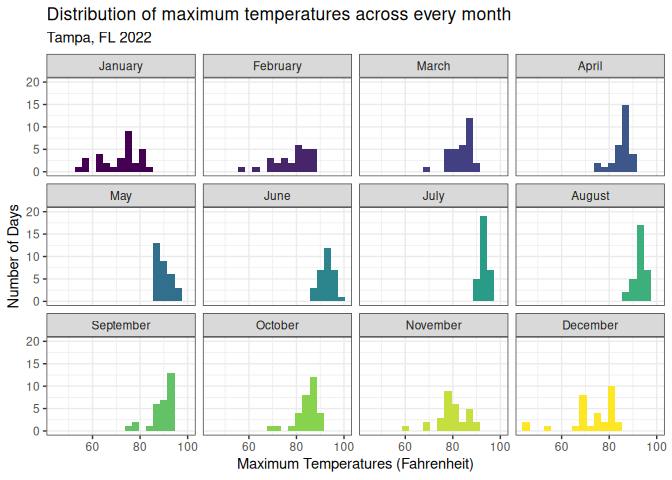
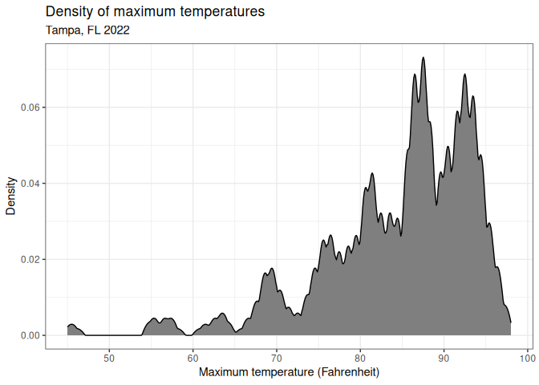
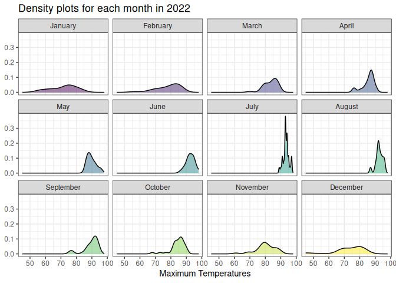
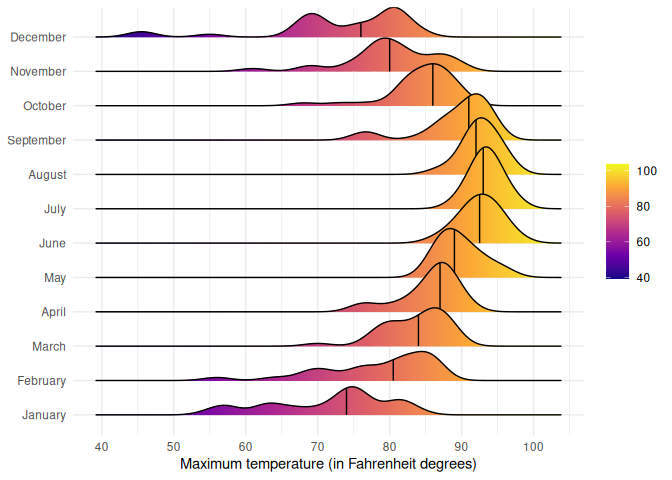
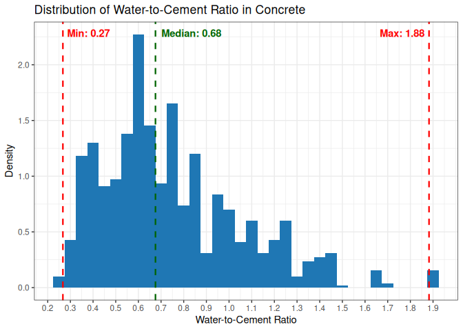
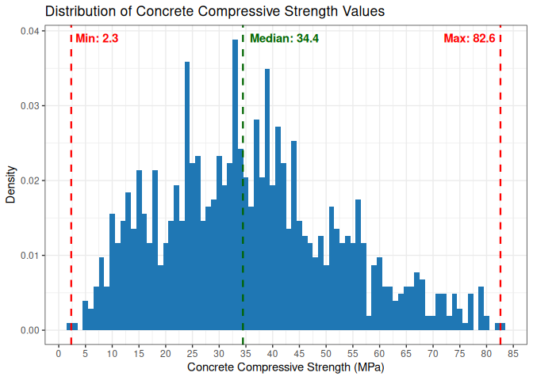
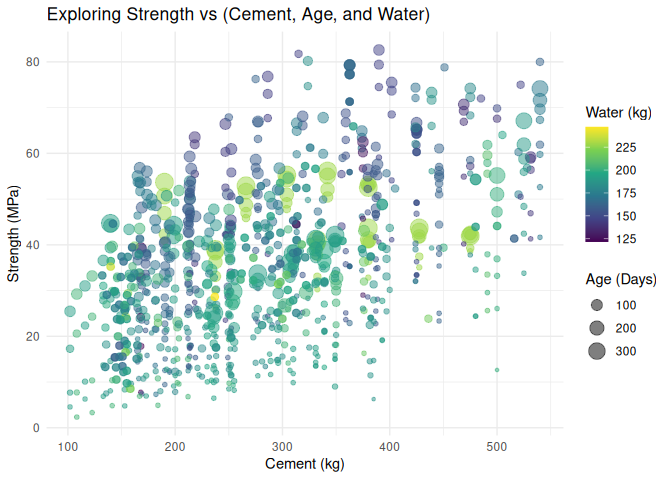

# Data Visualization Project 03


In this exercise you will explore methods to create different types of data visualizations (such as plotting text data, or exploring the distributions of continuous variables).


## PART 1: Density Plots

Using the dataset obtained from FSU's [Florida Climate Center](https://climatecenter.fsu.edu/climate-data-access-tools/downloadable-data), for a station at Tampa International Airport (TPA) for 2022, attempt to recreate the charts shown below which were generated using data from 2016. You can read the 2022 dataset using the code below: 


``` r
library(tidyverse)
library(lubridate)
library(ggridges)
library(plotly)
```


``` r
weather_tpa <- read_csv("https://raw.githubusercontent.com/aalhamadani/datasets/master/tpa_weather_2022.csv")
# random sample 
sample_n(weather_tpa, 4)
```

```
## # A tibble: 4 × 7
##    year month   day precipitation max_temp min_temp ave_temp
##   <dbl> <dbl> <dbl>         <dbl>    <dbl>    <dbl>    <dbl>
## 1  2022     9    25             0       92       73     82.5
## 2  2022    10     8             0       88       65     76.5
## 3  2022     7    13             0       94       80     87  
## 4  2022     6    26             0       96       78     87
```

### A.


``` r
months <- c("January", "February", "March", "April", "May", "June", "July", "August", "September", "October", "November", "December")

weather_tpa |>
  ggplot(aes(max_temp)) +
  geom_histogram(aes(fill = month), binwidth=3, show.legend = FALSE) + 
  facet_wrap(~ factor(month, levels= 1:12, labels=months)) +
  scale_y_continuous(limits = c(0, 20)) +
  scale_fill_viridis_c() +
  theme_bw() + 
  labs(
    title = "Distribution of maximum temperatures across every month",
    subtitle = "Tampa, FL 2022",
    x = "Maximum Temperatures (Fahrenheit)",
    y = "Number of Days"
  )
```



### B.


``` r
weather_tpa |>
  ggplot(aes(max_temp)) + 
  geom_density(fill="grey50", bw=0.5, kernel="epanechnikov") +
  labs(
    title = "Density of maximum temperatures",
    subtitle = "Tampa, FL 2022",
    x = "Maximum temperature (Fahrenheit)",
    y = "Density"
  ) +
  theme_bw()
```



### C.


``` r
weather_tpa |>
  ggplot(aes(max_temp)) +
  geom_density(aes(fill = month), show.legend = FALSE, alpha = 0.5) + 
  facet_wrap(~ factor(month, levels= 1:12, labels=months)) +
  scale_fill_viridis_c() +
  theme_bw() + 
  labs(
    title = "Density plots for each month in 2022",
    x = "Maximum Temperatures",
    y = NULL,
  )
```


Hint: default options for `geom_density()` were used. 

### D.


``` r
weather_tpa |>
  group_by(month) |>
  ggplot() +
  geom_density_ridges_gradient(aes(x=max_temp, y=factor(month, levels = 1:12, labels = months), group = month, fill = stat(x)), quantile_lines = TRUE, quantiles = 2) +
  scale_fill_viridis_c(option = "plasma") + 
  scale_x_continuous(n.breaks = 10) + 
  theme_minimal() +
  labs(
    x = "Maximum temperature (in Fahrenheit degrees)",
    y = NULL,
    fill = NULL,
  )
```



### E.

``` r
tooltip_text <- function(month_idx, mean_precip, max_precip) {
  paste0(
      "<b>", months[month_idx], "</b><br>",
      "<b>Mean: </b>", round(mean_precip, 3), " in<br>",
      "<b>Max: </b>", max_precip, " in<br>"
    )
}

weather_new <- weather_tpa |>
  summarize(
    mean_precip = mean(precipitation), 
    max_precip = max(precipitation),
    .by = c(month)
  )

weather_new <-  weather_new |> mutate(tooltip = tooltip_text(month, mean_precip, max_precip))

(weather_new |>
  ggplot() +
  geom_col(aes(factor(month, levels = 1:12, labels = months), mean_precip, text = tooltip), fill = "#1F77B4") + 
  coord_flip() + 
  scale_y_continuous(n.breaks=10) +
  scale_x_discrete(limits = rev) +
  theme_bw() +
  labs(
    title = "Mean precipitation in Tampa, FL 2022",
    x = NULL,
    y = "Mean precipitation (inches)"
  )
) |> ggplotly(tooltip = "tooltip")
```

```{=html}
<div class="plotly html-widget html-fill-item" id="htmlwidget-a03567d9a8b6c3de6546" style="width:672px;height:480px;"></div>
<script type="application/json" data-for="htmlwidget-a03567d9a8b6c3de6546">{"x":{"data":[{"orientation":"h","width":[0.89999999999999858,0.89999999999999858,0.89999999999999858,0.89999999999999858,0.89999999999999947,0.90000000000000036,0.90000000000000036,0.90000000000000036,0.90000000000000036,0.90000000000000036,0.90000000000000013,0.89999999999999991],"base":[0,0,0,0,0,0,0,0,0,0,0,0],"x":[0.047098064516129037,0.022143571428571429,0.093871612903225807,0.22533333333333336,0.087419999999999998,0.26900099999999999,0.38677516129032258,0.2100016129032258,0.40966733333333333,0.035484838709677419,0.17266799999999999,0.075806774193548393],"y":[12,11,10,9,8,7,6,5,4,3,2,1],"text":["<b>January<\/b><br><b>Mean: <\/b>0.047 in<br><b>Max: <\/b>0.68 in<br>","<b>February<\/b><br><b>Mean: <\/b>0.022 in<br><b>Max: <\/b>0.35 in<br>","<b>March<\/b><br><b>Mean: <\/b>0.094 in<br><b>Max: <\/b>1.42 in<br>","<b>April<\/b><br><b>Mean: <\/b>0.225 in<br><b>Max: <\/b>1.56 in<br>","<b>May<\/b><br><b>Mean: <\/b>0.087 in<br><b>Max: <\/b>1.65 in<br>","<b>June<\/b><br><b>Mean: <\/b>0.269 in<br><b>Max: <\/b>2.81 in<br>","<b>July<\/b><br><b>Mean: <\/b>0.387 in<br><b>Max: <\/b>2.86 in<br>","<b>August<\/b><br><b>Mean: <\/b>0.21 in<br><b>Max: <\/b>1.28 in<br>","<b>September<\/b><br><b>Mean: <\/b>0.41 in<br><b>Max: <\/b>2.74 in<br>","<b>October<\/b><br><b>Mean: <\/b>0.035 in<br><b>Max: <\/b>0.71 in<br>","<b>November<\/b><br><b>Mean: <\/b>0.173 in<br><b>Max: <\/b>2.46 in<br>","<b>December<\/b><br><b>Mean: <\/b>0.076 in<br><b>Max: <\/b>1.09 in<br>"],"type":"bar","textposition":"none","marker":{"autocolorscale":false,"color":"rgba(31,119,180,1)","line":{"width":1.8897637795275593,"color":"transparent"}},"showlegend":false,"xaxis":"x","yaxis":"y","hoverinfo":"text","frame":null}],"layout":{"margin":{"t":40.840182648401829,"r":7.3059360730593621,"b":37.260273972602747,"l":63.561643835616451},"plot_bgcolor":"rgba(255,255,255,1)","paper_bgcolor":"rgba(255,255,255,1)","font":{"color":"rgba(0,0,0,1)","family":"","size":14.611872146118724},"title":{"text":"Mean precipitation in Tampa, FL 2022","font":{"color":"rgba(0,0,0,1)","family":"","size":17.534246575342465},"x":0,"xref":"paper"},"xaxis":{"domain":[0,1],"automargin":true,"type":"linear","autorange":false,"range":[-0.020483366666666669,0.4301507],"tickmode":"array","ticktext":["0.00","0.05","0.10","0.15","0.20","0.25","0.30","0.35","0.40"],"tickvals":[0,0.050000000000000003,0.10000000000000002,0.15000000000000002,0.20000000000000001,0.25,0.30000000000000004,0.35000000000000003,0.40000000000000002],"categoryorder":"array","categoryarray":["0.00","0.05","0.10","0.15","0.20","0.25","0.30","0.35","0.40"],"nticks":null,"ticks":"outside","tickcolor":"rgba(51,51,51,1)","ticklen":3.6529680365296811,"tickwidth":0.66417600664176002,"showticklabels":true,"tickfont":{"color":"rgba(77,77,77,1)","family":"","size":11.68949771689498},"tickangle":-0,"showline":false,"linecolor":null,"linewidth":0,"showgrid":true,"gridcolor":"rgba(235,235,235,1)","gridwidth":0.66417600664176002,"zeroline":false,"anchor":"y","title":{"text":"Mean precipitation (inches)","font":{"color":"rgba(0,0,0,1)","family":"","size":14.611872146118724}},"hoverformat":".2f"},"yaxis":{"domain":[0,1],"automargin":true,"type":"linear","autorange":false,"range":[0.40000000000000002,12.6],"tickmode":"array","ticktext":["December","November","October","September","August","July","June","May","April","March","February","January"],"tickvals":[1,2,3,4.0000000000000009,5,6,7.0000000000000009,8,9,10,11,12],"categoryorder":"array","categoryarray":["December","November","October","September","August","July","June","May","April","March","February","January"],"nticks":null,"ticks":"outside","tickcolor":"rgba(51,51,51,1)","ticklen":3.6529680365296811,"tickwidth":0.66417600664176002,"showticklabels":true,"tickfont":{"color":"rgba(77,77,77,1)","family":"","size":11.68949771689498},"tickangle":-0,"showline":false,"linecolor":null,"linewidth":0,"showgrid":true,"gridcolor":"rgba(235,235,235,1)","gridwidth":0.66417600664176002,"zeroline":false,"anchor":"x","title":{"text":"","font":{"color":"rgba(0,0,0,1)","family":"","size":14.611872146118724}},"hoverformat":".2f"},"shapes":[{"type":"rect","fillcolor":"rgba(255,255,255,1)","line":{"color":"rgba(51,51,51,1)","width":0.66417600664176002,"linetype":"solid"},"yref":"paper","xref":"paper","layer":"below","x0":0,"x1":1,"y0":0,"y1":1}],"showlegend":false,"legend":{"bgcolor":"rgba(255,255,255,1)","bordercolor":"transparent","borderwidth":1.8897637795275593,"font":{"color":"rgba(0,0,0,1)","family":"","size":11.68949771689498}},"hovermode":"closest","barmode":"relative"},"config":{"doubleClick":"reset","modeBarButtonsToAdd":["hoverclosest","hovercompare"],"showSendToCloud":false},"source":"A","attrs":{"52494fd85751":{"x":{},"y":{},"text":{},"type":"bar"}},"cur_data":"52494fd85751","visdat":{"52494fd85751":["function (y) ","x"]},"highlight":{"on":"plotly_click","persistent":false,"dynamic":false,"selectize":false,"opacityDim":0.20000000000000001,"selected":{"opacity":1},"debounce":0},"shinyEvents":["plotly_hover","plotly_click","plotly_selected","plotly_relayout","plotly_brushed","plotly_brushing","plotly_clickannotation","plotly_doubleclick","plotly_deselect","plotly_afterplot","plotly_sunburstclick"],"base_url":"https://plot.ly"},"evals":[],"jsHooks":[]}</script>
```

## PART 2: Data on Concrete Strength
Concrete is the most important material in **civil engineering**. The concrete compressive strength is a highly nonlinear function of _age_ and _ingredients_. The dataset used here is from the [UCI Machine Learning Repository](https://archive.ics.uci.edu/ml/index.php), and it contains 1030 observations with 9 different attributes 9 (8 quantitative input variables, and 1 quantitative output variable). A data dictionary is included below: 


Variable                      |    Notes                
------------------------------|-------------------------------------------
Cement                        | kg in a $m^3$ mixture             
Blast Furnace Slag            | kg in a $m^3$ mixture  
Fly Ash                       | kg in a $m^3$ mixture             
Water                         | kg in a $m^3$ mixture              
Superplasticizer              | kg in a $m^3$ mixture
Coarse Aggregate              | kg in a $m^3$ mixture
Fine Aggregate                | kg in a $m^3$ mixture      
Age                           | in days                                             
Concrete compressive strength | MPa, megapascals


Below we read the `.csv` file using `readr::read_csv()` (the `readr` package is part of the `tidyverse`)


``` r
concrete <- read_csv("../data/concrete.csv", col_types = cols())
```


Let us create a new attribute for visualization purposes, `strength_range`: 


``` r
new_concrete <- concrete %>%
  mutate(strength_range = cut(Concrete_compressive_strength, 
                              breaks = quantile(Concrete_compressive_strength, 
                                                probs = seq(0, 1, 0.2))) )
```


### 1. 

Explore the distribution of 2 of the continuous variables available in the dataset. Do ranges make sense? Comment on your findings.


``` r
w_c_stats <- new_concrete |>
  mutate(water_to_cement = Water / Cement) |>
  summarize(
    min = min(water_to_cement),
    median = median(water_to_cement),
    max = max(water_to_cement)
  )

new_concrete |>
  mutate(water_to_cement = Water / Cement) |>
  ggplot() +
  geom_histogram(aes(water_to_cement, after_stat(density)), binwidth=0.05, fill = "#1F77B4") + 
  scale_x_continuous(breaks = seq(0.2, 1.9, by = 0.1)) +
  geom_vline(xintercept = c(w_c_stats$min, w_c_stats$median, w_c_stats$max), 
             color = c("red", "darkgreen", "red"), linetype = "dashed", linewidth = 0.8) +
  annotate("text", x = w_c_stats$min, y = Inf, label = paste0("Min: ", round(w_c_stats$min, 2)), 
           vjust = 2, hjust = -0.1, color = "red", fontface = "bold") +
  annotate("text", x = w_c_stats$median, y = Inf, label = paste0("Median: ", round(w_c_stats$median, 2)), 
           vjust = 2, hjust = -0.1, color = "darkgreen", fontface = "bold") +
  annotate("text", x = w_c_stats$max, y = Inf, label = paste0("Max: ", round(w_c_stats$max, 2)), 
           vjust = 2, hjust = 1.1, color = "red", fontface = "bold") +
  theme_bw() +
  labs(
    title = "Distribution of Water-to-Cement Ratio in Concrete",
    x = "Water-to-Cement Ratio",
    y = "Density",
  )
```



``` r
strength_stats <- new_concrete |>
  summarize(
    min = min(Concrete_compressive_strength),
    median = median(Concrete_compressive_strength),
    max = max(Concrete_compressive_strength)
  )

new_concrete |>
  ggplot() +
  geom_histogram(aes(Concrete_compressive_strength, after_stat(density)), binwidth=1, fill = "#1F77B4") +
  scale_x_continuous(breaks = seq(0, 85, by = 5)) +
  geom_vline(xintercept = c(strength_stats$min, strength_stats$median, strength_stats$max), 
             color = c("red", "darkgreen", "red"), linetype = "dashed", linewidth = 0.8) +
  annotate("text", x = strength_stats$min, y = Inf, label = paste0("Min: ", round(strength_stats$min, 1)), 
           vjust = 2, hjust = -0.1, color = "red", fontface = "bold") +
  annotate("text", x = strength_stats$median, y = Inf, label = paste0("Median: ", round(strength_stats$median, 1)), 
           vjust = 2, hjust = -0.1, color = "darkgreen", fontface = "bold") +
  annotate("text", x = strength_stats$max, y = Inf, label = paste0("Max: ", round(strength_stats$max, 1)), 
           vjust = 2, hjust = 1.1, color = "red", fontface = "bold") +
  theme_bw() + 
  labs(
    title = "Distribution of Concrete Compressive Strength Values",
    x = "Concrete Compressive Strength (MPa)",
    y = "Density",
  )
```



For the distribution of the water-to-cement ratio, the minimum value is 0.27, the maximum is 1.88, and the median is 0.68.
The median value is skewed to the left; samples in the dataset favor lower water-to-cement ratios.
This distribution matches typical values for water-to-cement ratio according to Wikipedia, which states values of 0.4 to 0.6.
The median value of 0.68 is a little higher than what Wikipedia says, but not much. 
https://en.wikipedia.org/wiki/Water%E2%80%93cement_ratio

For the distribution of concrete compressive strength, the minimum is about 2.3MPa and the maximum is about 82.6MPa, with a median of about 34.4MPa.
The median value is roughly in the middle; samples in the dataset follow a roughly normal distribution of concrete compressive strength values.
This distribution matches Wikipedia, which states values of 17 to 70. The median of 34.4MPa for this dataset in well within the range of good values.
https://en.wikipedia.org/wiki/Compressive_strength#Typical_values

### 2. 


``` r
(new_concrete |>
  filter(!is.na(strength_range)) |>
  ggplot(aes(as.factor(Age), Concrete_compressive_strength, fill = strength_range)) +
  geom_boxplot(orientation = 'x') + 
  theme_minimal() + 
  labs(
    title = "Distribution of Concrete Compressive Strength Values for Different Ages",
    x = "Age (in Days)",
    y = "Compressive Strength (in MPa)",
    fill = "Strength Range",
  )) |> ggplotly()
```

```{=html}
<div class="plotly html-widget html-fill-item" id="htmlwidget-50af56b6837884cd4b48" style="width:672px;height:480px;"></div>
<script type="application/json" data-for="htmlwidget-50af56b6837884cd4b48">{"x":{"data":[{"x":[2,2,2,2,2,2,2,2,2,2,2,2,2,2,2,2,2,2,2,2,2,2,2,2,2,2,2,2,2,2,2,2,2,2,2,2,2,2,2,2,2,2,2,2,2,2,2,2,2,2,2,2,2,2,2,2,2,2,2,2,2,2,2,2,2,2,2,2,2,2,2,2,2,2,2,2,2,2,2,2,2,3,3,3,3,3,3,3,3,3,3,3,3,3,3,3,3,3,3,3,3,3,3,3,3,3,3,3,3,3,3,3,3,3,3,3,3,3,3,3,3,3,3,3,3,3,3,3,3,3,3,3,3,3,3,3,3,3,3,3,4,4,4,4,4,4,4,4,4,4,5,5,5,5,5,5,5,5,5,5,5,5,5,5,5,5,5,5,5,5,5,5,5,5,5,5,5,5,5,5,5,5,5,5,5,5,5,5,5,5,5,5,5,5,5,5,5,5,5,5,5,5,5,1,1],"y":[17.57474324,4.7822055360000002,12.17614616,10.0318758,6.9409548919999997,8.0634218200000003,4.5650205960000001,17.995323599999999,15.87173752,7.3153403600000004,17.36790044,10.383508559999999,15.609736639999999,9.5616531679999994,4.8277109520000003,15.04919265,11.57630204,12.78840085,12.541568440000001,11.85209244,7.7497102399999998,9.4458211999999993,8.2040749240000004,11.414275180000001,12.472620839999999,9.6947220359999999,14.39625888,14.98920824,13.565440300000001,6.8085754999999999,20.72564856,6.9023442360000002,14.94094492,6.2804368840000002,15.520104760000001,16.278528359999999,12.5484632,6.8837283840000003,14.14391066,15.43736764,9.1314201439999998,13.62404576,12.45193656,10.762720359999999,3.31982694,17.223110479999999,15.340840999999999,19.519065560000001,11.36256448,13.12072828,16.10960674,13.54130864,9.3079260000000001,6.4672848800000002,11.983092879999999,15.615941919999999,4.9035533119999997,19.415644159999999,9.731264264,13.22414968,15.04436632,9.8664015599999999,13.81709904,15.81657944,18.01600788,14.306627000000001,7.3980774800000004,8.4874495599999999,13.520624359999999,13.18278112,13.520624359999999,19.932751159999999,11.6549023,14.69962832,9.8496571460000002,15.36152528,13.33446584,19.199148699999999,13.355150119999999,13.39553372,19.10537996,14.638264960000001,10.7875415,18.12632404,12.37264682,10.3938507,15.575262840000001,10.335934719999999,17.23621052,7.9958531720000003,11.39221195,19.350143939999999,7.7235101520000002,11.46598588,9.6175007239999992,14.98920824,10.73031499,7.6759363079999998,14.5968964,10.22217118,7.5070146879999999,11.46598588,7.8393421200000004,20.416073839999999,11.169511200000001,16.8894041,17.20035777,17.436848040000001,14.58931216,14.2032056,18.12632404,10.089791780000001,16.26473884,14.49968028,19.765208489999999,14.54104884,9.9905072399999995,18.91232668,12.05204048,14.796154960000001,11.95758227,8.3743754960000008,14.2032056,15.0305768,10.354550570000001,15.748321320000001,13.71367764,13.08901238,15.06997543,15.691094809999999,17.24379476,12.73462172,20.277489159999998,19.539060360000001,17.540269439999999,13.664035370000001,9.0114513200000008,17.165883969999999,14.843728799999999,11.48391226,17.822954599999999,20.918701840000001,12.83804312,17.836744119999999,20.72564856,19.415644159999999,20.084435880000001,20.77391188,18.12632404,16.878372479999999,18.198719019999999,17.340321400000001,15.340840999999999,12.45883132,12.24509376,19.765208489999999,15.08573488,13.46132942,17.95395504,17.596806470000001,9.7381590239999998,12.4595208,18.746162959999999,17.275510659999998,19.98790924,19.691434560000001,17.57612219,13.196570639999999,10.53588276,16.499160679999999,12.18097249,18.415903960000001,13.45857152,15.41668336,9.7354011200000006,19.691434560000001,17.959470849999999,15.520104760000001,20.87043852,15.42357812,8.536402356,10.53519328,13.29378676,18.28490352,18.0297974,13.202086449999999,15.52631004,17.964297179999999,12.17614616,18.033934259999999,15.568368080000001,19.009542799999998,18.287661419999999,16.503987009999999,8.5357128800000002,20.59395864,19.00885332,17.540269439999999,17.540269439999999,15.56974703,13.29309728,15.091250690000001,19.98790924,12.638095079999999,6.2673368399999996],"hoverinfo":"y","type":"box","fillcolor":"rgba(248,118,109,1)","marker":{"opacity":null,"outliercolor":"rgba(0,0,0,1)","line":{"width":1.8897637795275593,"color":"rgba(0,0,0,1)"},"size":5.6692913385826778},"line":{"color":"rgba(51,51,51,1)","width":1.8897637795275593},"name":"(2.33,21]","legendgroup":"(2.33,21]","showlegend":true,"xaxis":"x","yaxis":"y","frame":null},{"x":[5,5,5,5,5,5,5,5,5,5,5,5,5,5,5,5,5,5,5,5,5,5,5,5,5,5,5,5,5,5,5,5,5,5,5,5,5,5,5,5,5,5,5,5,5,5,5,5,5,5,5,5,5,5,5,5,5,5,5,5,5,5,5,5,5,5,5,5,5,5,5,5,5,5,5,5,5,5,5,5,5,5,5,5,5,5,5,5,5,5,5,5,5,5,5,5,5,5,5,5,5,5,5,3,3,3,3,3,3,3,3,3,3,3,3,3,3,3,3,3,3,3,3,3,3,3,3,2,2,2,2,2,2,2,2,2,2,2,2,2,2,2,2,2,2,2,2,2,2,2,2,2,2,2,2,2,2,2,4,4,4,4,4,4,4,4,4,4,4,4,4,4,4,4,4,4,4,4,4,4,4,4,4,4,4,4,4,4,6,6,6,6,6,7,7,7,7,7,7,7,11,11,11,11,14,14],"y":[30.571365839999999,28.62980142,28.991086849999999,29.723310359999999,29.068308160000001,30.123206440000001,25.5595648,26.85991653,28.937997200000002,28.98557104,23.69039536,29.41304616,23.52423164,22.93197176,26.922658850000001,28.627043520000001,25.216895220000001,26.22766704,30.439675919999999,23.84897484,21.911547280000001,22.629981269999998,23.73865868,26.848195440000001,27.337723400000002,21.539230239999998,28.021683589999999,24.24197616,29.21999288,28.468464040000001,24.890083600000001,21.649546399999998,27.93549909,26.855090199999999,25.096926400000001,21.966705359999999,23.890343399999999,28.237489579999998,26.913695659999998,26.144929919999999,24.848715039999998,25.57335432,27.22051248,26.40003604,27.681082450000002,23.786922000000001,27.8748252,24.90387312,23.51802636,26.233182849999999,27.530776679999999,24.483292760000001,30.079769450000001,24.290928959999999,23.835185320000001,26.965406359999999,25.179663519999998,29.86810032,25.179663519999998,22.835445119999999,21.7529678,23.69660064,22.48932817,26.147687820000002,22.435549040000001,25.745033840000001,24.281965769999999,22.34798559,30.219733080000001,30.84715624,24.538450839999999,21.0662497,25.103821159999999,24.497082280000001,27.67556664,25.726417990000002,23.835874799999999,23.744174489999999,24.04616498,22.435549040000001,29.870858219999999,29.654362760000001,27.923777999999999,30.647208200000001,25.179663519999998,29.892231979999998,27.77209328,24.338502800000001,30.123206440000001,30.233522600000001,27.827251360000002,25.72434956,25.558875319999999,23.786922000000001,29.073134490000001,30.881630040000001,29.15794004,24.579819400000002,27.234302,29.726068260000002,26.200088000000001,26.917143039999999,25.965666160000001,27.74244581,21.480624779999999,25.893960660000001,24.43778734,21.859147100000001,23.404952300000001,24.000659559999999,26.258003980000002,26.062192799999998,21.81984697,24.000659559999999,21.917063089999999,22.897497959999999,25.422359069999999,21.160018440000002,20.966965160000001,21.17932377,30.275580640000001,25.44786968,24.065470300000001,23.523542169999999,23.221551680000001,30.143890720000002,24.13166,23.80071152,24.40055564,23.07676172,24.404692499999999,24.097186199999999,26.062192799999998,22.945761279999999,21.022123239999999,25.116625719999998,23.13881456,21.911547280000001,28.096146999999998,25.60910857,28.99936056,29.548971430000002,23.524921119999998,25.200347799999999,27.420460519999999,21.291018879999999,23.345657360000001,28.599464480000002,30.447260159999999,22.752707999999998,25.510611999999998,24.393660879999999,21.78054684,22.504496639999999,23.639177149999998,25.021084040000002,28.799412520000001,28.296095040000001,26.048403279999999,24.448818960000001,23.511131599999999,27.923777999999999,29.550941359999999,27.041248719999999,29.592309920000002,21.504756440000001,24.655661760000001,22.718234200000001,25.620928159999998,26.310404160000001,21.601283080000002,29.93015316,22.31833812,24.91766264,29.750889399999998,25.68987576,21.26343984,24.283344719999999,24.428134679999999,24.986610240000001,21.063491800000001,28.682201599999999,22.139074359999999,25.372716799999999,25.483032959999999,22.532075679999998,26.772353079999998,30.385207319999999,23.24519085,29.97841648,29.447519960000001,28.627043520000001,27.66177712,26.944722079999998,26.322814730000001,21.946021080000001,25.460969729999999,21.859147100000001,29.231713970000001,29.392361879999999,29.58541516,27.627303319999999,24.104080960000001,26.744774039999999,25.083136880000001,29.785363199999999],"hoverinfo":"y","type":"box","fillcolor":"rgba(163,165,0,1)","marker":{"opacity":null,"outliercolor":"rgba(0,0,0,1)","line":{"width":1.8897637795275593,"color":"rgba(0,0,0,1)"},"size":5.6692913385826778},"line":{"color":"rgba(51,51,51,1)","width":1.8897637795275593},"name":"(21,30.9]","legendgroup":"(21,30.9]","showlegend":true,"xaxis":"x","yaxis":"y","frame":null},{"x":[5,5,5,5,5,5,5,5,5,5,5,5,5,5,5,5,5,5,5,5,5,5,5,5,5,5,5,5,5,5,5,5,5,5,5,5,5,5,5,5,5,5,5,5,5,5,5,5,5,5,5,5,5,5,5,5,5,5,5,5,5,5,5,5,5,5,5,5,5,5,5,5,5,5,5,5,5,5,5,5,5,5,5,5,5,5,5,5,5,5,5,5,5,5,5,5,5,5,5,5,5,5,5,5,7,7,7,7,7,7,7,7,7,7,7,7,7,7,7,7,7,3,3,3,3,3,3,3,3,3,3,3,3,3,3,3,3,3,12,11,11,11,11,11,11,11,14,14,14,2,2,2,2,2,2,2,2,2,2,2,2,2,2,2,9,9,9,9,9,9,9,6,6,6,6,6,6,6,6,6,6,6,6,6,6,6,6,4,4,4,4,4,4,4,4,4,4,4,4,4,4,4,4,13,13,10],"y":[33.947729809999998,31.17810472,37.424757280000001,33.399596389999999,33.301690800000003,37.431652040000003,36.96418731,31.646948399999999,31.966865259999999,33.756744959999999,32.401235139999997,37.404072999999997,37.914285239999998,37.431652040000003,37.810863840000003,33.082437429999999,31.4201108,34.735800879999999,32.884557819999998,32.626693799999998,33.687797359999998,31.899986089999999,33.687797359999998,31.267736599999999,37.265488320000003,33.72916592,33.664355180000001,32.963847559999998,33.306517130000003,33.019005640000003,32.839741879999998,31.447000360000001,37.169651160000001,38.215586250000001,33.798113520000001,32.720462529999999,35.859646759999997,37.917043139999997,31.116051880000001,31.026420000000002,36.44363293,37.171030109999997,32.239897759999998,37.813621740000002,33.942903479999998,36.438806599999999,32.956952800000003,38.700287879999998,38.500339840000002,31.875164959999999,32.245413569999997,36.804228879999997,31.640053640000001,31.419421320000001,35.225328840000003,31.178794199999999,33.715376399999997,33.762260769999997,33.60506024,38.461039710000001,32.72253096,31.84000168,35.225328840000003,33.419591199999999,38.45897128,37.42751518,37.25928304,33.418901720000001,37.362704440000002,31.35047372,35.314271239999997,31.874475480000001,36.349864199999999,33.003837169999997,36.447769790000002,33.718823780000001,36.349174720000001,37.266177800000001,31.971002120000001,37.437857319999999,32.051670809999997,33.060374199999998,32.768036379999998,38.630650799999998,38.804398759999998,38.203865159999999,32.398477239999998,37.36339392,36.804918360000002,32.763899520000002,31.74347504,38.210759920000001,33.274111759999997,33.398217440000003,31.38150014,33.053479439999997,33.798802999999999,36.935229319999998,35.86585204,34.294536239999999,32.660478120000001,33.043137299999998,37.424757280000001,32.039949720000003,32.102692040000001,33.192064119999998,38.074243670000001,32.922479000000003,37.914285239999998,31.023662099999999,35.763120120000004,36.588422889999997,31.25394708,37.721921440000003,34.680642800000001,32.532925059999997,32.06821824,33.116911229999999,35.170170759999998,37.231704000000001,31.35047372,34.901275120000001,33.398217440000003,38.01770664,37.92118,38.603761239999997,37.997022360000003,39.004642279999999,33.212058919999997,35.101223160000004,38.610655999999999,36.838702679999997,33.488834279999999,30.9574724,32.823194460000003,35.754255430000001,34.569637159999999,35.076402020000003,38.407950059999997,32.329529639999997,36.251958600000002,32.72253096,38.996762560000001,34.48758952,36.445701360000001,37.328230640000001,38.995383609999998,36.149226679999998,38.893341159999999,34.77027468,33.398217440000003,33.798113520000001,36.300911399999997,35.301171199999999,37.79707432,35.301171199999999,35.363224039999999,32.01138572,33.398217440000003,35.301171199999999,34.397957640000001,32.109882280000001,35.301171199999999,33.398217440000003,35.342539760000001,34.556537120000002,37.9556538,33.563691679999998,37.342020159999997,37.679863400000002,33.5430074,31.35047372,36.638754640000002,36.562912279999999,31.715896000000001,38.327970839999999,35.570066840000003,31.536632239999999,36.300911399999997,35.342539760000001,37.266177800000001,35.852752000000002,32.853531400000001,34.20490436,38.562392680000002,33.963587760000003,36.969703119999998,32.901794719999998,33.701586880000001,38.603761239999997,35.956173399999997,31.35047372,36.935229319999998,33.72916592,35.232223599999998,33.00521612,38.769235479999999,33.356848880000001,34.239378160000001,33.087953239999997,31.812422640000001,34.67374804,36.990387400000003,33.701586880000001,38.114233280000001,38.700287879999998],"hoverinfo":"y","type":"box","fillcolor":"rgba(0,191,125,1)","marker":{"opacity":null,"outliercolor":"rgba(0,0,0,1)","line":{"width":1.8897637795275593,"color":"rgba(0,0,0,1)"},"size":5.6692913385826778},"line":{"color":"rgba(51,51,51,1)","width":1.8897637795275593},"name":"(30.9,39]","legendgroup":"(30.9,39]","showlegend":true,"xaxis":"x","yaxis":"y","frame":null},{"x":[12,12,12,12,14,14,14,14,13,13,13,13,7,7,7,7,7,7,7,7,7,7,7,7,7,7,7,7,7,7,7,7,7,5,5,5,5,5,5,5,5,5,5,5,5,5,5,5,5,5,5,5,5,5,5,5,5,5,5,5,5,5,5,5,5,5,5,5,5,5,5,5,5,5,5,5,5,5,5,5,5,5,5,5,5,5,5,5,5,5,5,5,5,5,5,5,5,5,5,5,5,5,5,5,5,5,5,5,5,5,5,5,5,5,5,5,5,5,5,5,5,11,11,11,11,11,11,11,11,11,2,2,2,2,2,2,3,3,3,3,3,3,3,3,3,3,3,3,3,3,3,3,9,9,9,9,9,9,9,9,9,9,9,9,9,9,9,9,9,9,9,9,9,9,9,9,9,9,9,6,6,6,6,6,6,6,6,6,6,6,6,6,6,6,6,6,6,6,6,4,4,4,4,4,10,10],"y":[42.131120459999998,41.151375059999999,43.01296026,40.269535259999998,41.052779989999998,41.9346198,43.698299400000003,43.698299400000003,42.126983600000003,41.244454320000003,44.296075100000003,44.698039600000001,39.486290519999997,47.029847439999998,40.658399719999998,43.565230540000002,39.700028080000003,39.358047980000002,43.377003590000001,43.25082948,40.563252030000001,41.54299743,47.714497100000003,39.662106899999998,48.846616699999998,49.185149410000001,48.794216519999999,50.459301060000001,42.326931639999998,47.22221124,47.782065750000001,41.680203149999997,42.229026050000002,39.699338599999997,41.20308576,49.77327244,49.249270680000002,40.856968809999998,42.637195839999997,40.058555599999998,44.278148719999997,44.388464880000001,39.321505760000001,39.582817159999998,41.68434001,48.284004279999998,43.942373910000001,39.162236800000002,44.326412040000001,39.375974360000001,46.68441996,39.093289200000001,44.6118551,46.68441996,45.854290859999999,39.300131999999998,44.609097200000001,42.14008364,44.864203320000001,41.051401040000002,40.925226930000001,39.455953579999999,40.934879600000002,39.417342920000003,39.051920639999999,40.8686899,47.401474999999998,44.519465320000002,41.409928559999997,40.865242520000002,43.733462680000002,46.247292180000002,40.148187479999997,43.377003590000001,46.24315532,45.705364039999999,47.277369319999998,43.798273420000001,49.897378119999999,49.77327244,41.540928999999998,41.940825080000003,40.230924600000002,39.396658639999998,43.574883200000002,40.934190119999997,39.604880389999998,41.542307950000001,44.284354,42.133878359999997,47.813781650000003,44.422938680000001,44.523602179999997,39.84481804,45.2985732,39.056057500000001,43.578330579999999,44.13335876,44.868340179999997,39.94134468,44.63667624,43.892042160000003,46.387945279999997,39.451816719999997,46.234192129999997,41.368560000000002,39.289789859999999,39.435269300000002,44.091990199999998,45.939785880000002,40.062002980000003,45.304778480000003,50.235221359999997,41.053469470000003,43.698988880000002,39.421479779999999,46.229365799999997,44.029937359999998,42.644090599999998,40.679084000000003,41.368560000000002,48.695621449999997,41.051401040000002,42.620648420000002,41.719503279999998,41.836714200000003,44.20782217,39.779317820000003,46.93194184,40.759063220000002,41.299612400000001,40.196450800000001,39.300131999999998,40.596346879999999,41.637455639999999,41.099664359999998,46.201786759999997,49.800851479999999,39.300131999999998,46.801630879999998,45.89841732,46.898157519999998,47.09810556,41.665034679999998,42.423458279999998,49.201007359999998,50.511011760000002,40.285097720000003,42.795775319999997,49.201007359999998,45.698469279999998,49.201007359999998,48.67011084,44.278148719999997,48.153003839999997,47.815160599999999,50.076641879999997,40.858347760000001,46.229365799999997,49.973220480000002,42.347615920000003,39.231184399999997,43.057776199999999,45.367520800000001,40.56876784,44.209201120000003,49.993904759999999,40.148187479999997,43.581777959999997,47.739318240000003,45.83636448,40.713557799999997,44.298833000000002,45.367520800000001,41.161717199999998,40.389504080000002,42.919880999999997,39.610396199999997,48.973480279999997,46.643051399999997,39.265658199999997,43.499040839999999,43.388724680000003,45.084835640000001,42.030456960000002,45.084835640000001,39.148447279999999,42.547563959999998,48.587373720000002,47.966845319999997,44.140253520000002,48.9872698,47.132579360000001,44.395359640000002,44.520450279999999,39.589711919999999,42.699248679999997,48.718374160000003,39.644869999999997,48.401215200000003,42.292457839999997,47.711739199999997,42.216615480000002,41.885666999999998,40.858347760000001,39.382869120000002],"hoverinfo":"y","type":"box","fillcolor":"rgba(0,176,246,1)","marker":{"opacity":null,"outliercolor":"rgba(0,0,0,1)","line":{"width":1.8897637795275593,"color":"rgba(0,0,0,1)"},"size":5.6692913385826778},"line":{"color":"rgba(51,51,51,1)","width":1.8897637795275593},"name":"(39,50.5]","legendgroup":"(39,50.5]","showlegend":true,"xaxis":"x","yaxis":"y","frame":null},{"x":[5,5,5,5,5,5,5,5,5,5,5,5,5,5,5,5,5,5,5,5,5,5,5,5,5,5,5,5,5,5,5,5,5,5,5,5,5,5,5,5,5,5,5,5,5,5,5,5,5,5,5,5,5,5,5,5,5,5,5,5,5,5,5,5,5,5,5,5,5,5,5,5,5,5,5,5,5,7,7,7,7,7,7,7,7,7,14,14,14,14,14,12,12,12,12,12,12,12,12,11,11,11,11,11,11,3,3,3,3,3,3,3,3,3,3,6,6,6,6,6,6,6,6,6,6,6,6,6,6,6,6,6,6,6,6,6,6,6,6,6,6,6,6,6,6,6,6,6,6,6,6,6,6,6,6,6,6,6,6,6,6,6,6,6,6,8,8,8,8,8,8,8,8,8,8,8,8,8,8,8,8,8,8,8,8,8,8,9,9,9,9,9,9,9,9,9,9,9,9,9,9,9,9,9,9,4],"y":[79.986110760000003,61.887365760000002,60.294676199999998,50.697170280000002,56.399136800000001,60.294676199999998,55.495923240000003,68.4994406,71.298713160000005,74.697829839999997,52.200227959999999,71.298713160000005,67.699648440000004,71.298713160000005,65.996642719999997,74.497881800000002,71.298713160000005,57.226508000000003,81.751169320000002,64.017846599999999,78.800212040000005,74.987409760000006,60.280886680000002,56.833506679999999,51.021223999999997,55.551081320000002,67.306647119999994,58.998461319999997,55.647607960000002,71.988189160000005,51.021223999999997,52.303649360000001,53.524711359999998,57.218234289999998,65.909079270000007,52.82696164,61.09446836,67.865122679999999,58.522722880000003,53.579179959999998,72.098505320000001,76.235361319999996,69.837024040000003,61.23581094,50.600643640000001,57.915984000000002,52.426376089999998,55.944082639999998,52.441544559999997,52.503597399999997,56.612874359999999,55.454554680000001,60.294676199999998,61.797733880000003,53.386126679999997,52.446370889999997,55.551081320000002,67.568647999999996,61.232363560000003,56.695611479999997,62.052840000000003,63.14221208,53.524021879999999,52.200227959999999,57.02655996,52.420860279999999,52.820756359999997,55.509712759999999,57.212718479999999,66.899856279999995,59.494884040000002,62.935369280000003,65.907010839999998,59.79825348,51.331488200000003,56.619079640000002,68.299492560000004,58.784723759999999,51.863763669999997,50.52686971,54.598914960000002,50.732333560000001,52.908319810000002,54.275550719999998,69.657760280000005,54.315540329999997,52.908319810000002,56.141962249999999,53.69225402,52.516697440000002,55.260122449999997,74.166933319999998,51.732763230000003,50.655112240000001,67.113593839999993,55.158079999999998,54.378282640000002,53.300631660000001,55.064311259999997,53.104131000000002,51.041908280000001,71.62276688,50.948829019999998,52.124385599999997,61.921839560000002,56.095767360000004,52.61391356,54.896079120000003,55.895819320000001,55.599344639999998,54.09628696,52.007174679999999,59.094987959999997,55.895819320000001,55.895819320000001,72.298453359999996,58.798513280000002,54.765078680000002,51.03501352,66.824013919999999,64.300531759999998,51.958911360000002,66.780675430000002,69.299232759999995,60.322255239999997,80.199848320000001,77.297154359999993,79.400056160000005,56.847296200000002,51.25564584,61.990787159999996,59.590425719999999,61.459890639999998,64.300531759999998,68.750606849999997,77.297154359999993,72.994824120000004,56.14403068,71.698609239999996,77.297154359999993,55.19944856,53.723969920000002,61.855846849999999,53.772233239999998,55.82687172,60.198149559999997,61.066889320000001,56.337083960000001,53.46196904,59.89478012,65.697213149999996,55.254606639999999,50.773012639999997,64.900375879999999,51.724489519999999,63.397318200000001,77.297154359999993,73.698089640000006,51.434909599999997,74.364911460000002,64.900375879999999,54.896079120000003,53.958391759999998,66.100064119999999,64.300531759999998,67.796175079999998,56.495663440000001,65.196850560000001,74.194512360000004,65.196850560000001,79.296634760000003,79.296634760000003,68.099544519999995,57.598825040000001,79.296634760000003,59.198409359999999,66.699908239999999,66.596486839999997,64.900375879999999,79.296634760000003,75.497622000000007,82.599224800000002,62.500999399999998,70.698869040000005,73.298193560000001,65.196850560000001,76.800731639999995,51.055697799999997,66.424117839999994,56.812822400000002,50.938486879999999,56.633558639999997,66.948119599999998,52.95865156,60.949678400000003,55.020184800000003,58.605460000000001,52.041648479999999,56.7438748,53.65502232,59.301830760000001,55.6407132,63.528318640000002,53.90323368,56.061293560000003,59.763779679999999],"hoverinfo":"y","type":"box","fillcolor":"rgba(231,107,243,1)","marker":{"opacity":null,"outliercolor":"rgba(0,0,0,1)","line":{"width":1.8897637795275593,"color":"rgba(0,0,0,1)"},"size":5.6692913385826778},"line":{"color":"rgba(51,51,51,1)","width":1.8897637795275593},"name":"(50.5,82.6]","legendgroup":"(50.5,82.6]","showlegend":true,"xaxis":"x","yaxis":"y","frame":null}],"layout":{"margin":{"t":40.840182648401829,"r":7.3059360730593621,"b":37.260273972602747,"l":37.260273972602747},"paper_bgcolor":"rgba(255,255,255,1)","font":{"color":"rgba(0,0,0,1)","family":"","size":14.611872146118724},"title":{"text":"Distribution of Concrete Compressive Strength Values for Different Ages","font":{"color":"rgba(0,0,0,1)","family":"","size":17.534246575342465},"x":0,"xref":"paper"},"xaxis":{"domain":[0,1],"automargin":true,"type":"linear","autorange":false,"range":[0.40000000000000002,14.6],"tickmode":"array","ticktext":["1","3","7","14","28","56","90","91","100","120","180","270","360","365"],"tickvals":[1,2,3,3.9999999999999996,5,6,7,7.9999999999999991,9,10,11,12,13,14],"categoryorder":"array","categoryarray":["1","3","7","14","28","56","90","91","100","120","180","270","360","365"],"nticks":null,"ticks":"","tickcolor":null,"ticklen":3.6529680365296811,"tickwidth":0,"showticklabels":true,"tickfont":{"color":"rgba(77,77,77,1)","family":"","size":11.68949771689498},"tickangle":-0,"showline":false,"linecolor":null,"linewidth":0,"showgrid":true,"gridcolor":"rgba(235,235,235,1)","gridwidth":0.66417600664176002,"zeroline":false,"anchor":"y","title":{"text":"Age (in Days)","font":{"color":"rgba(0,0,0,1)","family":"","size":14.611872146118724}},"hoverformat":".2f"},"yaxis":{"domain":[0,1],"automargin":true,"type":"linear","autorange":false,"range":[-0.64414295300000024,86.563194693],"tickmode":"array","ticktext":["0","20","40","60","80"],"tickvals":[0,20,40,60,80],"categoryorder":"array","categoryarray":["0","20","40","60","80"],"nticks":null,"ticks":"","tickcolor":null,"ticklen":3.6529680365296811,"tickwidth":0,"showticklabels":true,"tickfont":{"color":"rgba(77,77,77,1)","family":"","size":11.68949771689498},"tickangle":-0,"showline":false,"linecolor":null,"linewidth":0,"showgrid":true,"gridcolor":"rgba(235,235,235,1)","gridwidth":0.66417600664176002,"zeroline":false,"anchor":"x","title":{"text":"Compressive Strength (in MPa)","font":{"color":"rgba(0,0,0,1)","family":"","size":14.611872146118724}},"hoverformat":".2f"},"shapes":[],"showlegend":true,"legend":{"bgcolor":null,"bordercolor":null,"borderwidth":0,"font":{"color":"rgba(0,0,0,1)","family":"","size":11.68949771689498},"title":{"text":"Strength Range","font":{"color":"rgba(0,0,0,1)","family":"","size":14.611872146118724}}},"hovermode":"closest","barmode":"relative"},"config":{"doubleClick":"reset","modeBarButtonsToAdd":["hoverclosest","hovercompare"],"showSendToCloud":false},"source":"A","attrs":{"524912e8902e":{"x":{},"y":{},"fill":{},"type":"box"}},"cur_data":"524912e8902e","visdat":{"524912e8902e":["function (y) ","x"]},"highlight":{"on":"plotly_click","persistent":false,"dynamic":false,"selectize":false,"opacityDim":0.20000000000000001,"selected":{"opacity":1},"debounce":0},"shinyEvents":["plotly_hover","plotly_click","plotly_selected","plotly_relayout","plotly_brushed","plotly_brushing","plotly_clickannotation","plotly_doubleclick","plotly_deselect","plotly_afterplot","plotly_sunburstclick"],"base_url":"https://plot.ly"},"evals":[],"jsHooks":[]}</script>
```
This graph shows a boxplot with the distibutions of compressive strength ranges for each given age in the dataset.
We can see that at an age of 91, there are only samples in the maximum strength range of (50.5MPa, 82.6MPa]. Samples
of any other age contain samples in the lower strength ranges. 
The median value for strength range is highest here as well with a value of 67.95MPa.
From this graph, it seems that there is an ideal time of about 91 days that concrete should age before use.

I modified this graph by adding interactivity. Now, hovering over a boxplot gives the statistical values for it.
This enables me to take quantifiable metrics from the graph for analysis. In addition, I made the box plots
stack on top of each other for each age. Before, the boxplots were jittered around each age, which was confusing.
It was hard to tell if the jittered box plots had an age of the nearest marking or the interpolated x-axis value.
In reality, there are only samples at the given age values seen in the graph, so it's clearer to stack them.

### 3. 


``` r
new_concrete |>
  ggplot(aes(Cement, Concrete_compressive_strength, size = Age, color = Water)) +
  geom_point(alpha = 0.5) + 
  scale_color_viridis_c() + 
  theme_minimal() + 
  labs(
    title = "Exploring Strength vs (Cement, Age, and Water)",
    x = "Cement (kg)",
    y = "Strength (MPa)",
    color = "Water (kg)",
    size = "Age (Days)",
  )
```



This graph shows the relationship between cement content and concrete compressive strength.
In addition, for each data point, it shows the water content and age using color and size.

It appears that, generally, more cement gives a greater strength, but there is a large spread.

Water content is spread out, but it seems that the concrete with the greatest strength has low water content.
There is a noticeable gradient from turquoise to purple as the strength increases. 
In addition, there is a small gradient as cement increases, which would make sense.
We can see the data points with low cement content of around 150kg tend to have a turquoise color 
and data points with higher cement content of around 300kg tend to have a greenish yellow color.
For higher cement content, the trend seems to reverse.

Age is spread out as well, but there is a cluster of small data points that seem to be less than 100 days old
where cement content is low and strength is low. As cement content increases, the age also seems to increase, with
clusters of larger data points around 300kg of cement content. It also seems that the strongest cement tends to be younger.
As strength increases the age goes from small to large to small again. This is in line with question 2, which showed that
there is an ideal age for concrete strength.
